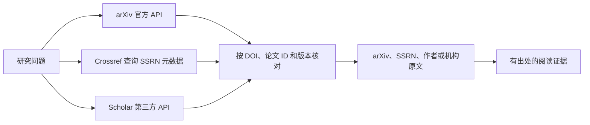

# Google Scholar、SSRN 与 arXiv：API、Skill、CLI 和 MCP 接入调研

调研日期：2026-09-25（America/Los_Angeles）。用途：为投资与量化策略文献检索选择可供 agent 使用的入口。

相关研究：[X 社区项目推荐与使用反馈](2026-09-25-scholarly-x-project-recommendations.md)，包含 alphaXiv MCP 的补充核验。

证据来自平台官方文档、工具维护者的代码与发布包，以及少量真实请求。本文区分“文档支持”“源码存在”和“本次运行成功”；不把工具自述的成功率当作本次测试结果。未购买服务、配置新账号或安装全局工具。CLI 测试使用临时检出的源码和 uv 隔离环境。

## 结论

**arXiv 可以直接使用官方 API；Google Scholar 的自动化接口主要来自第三方；SSRN 尚未找到面向公众、具有公开接入文档的官方检索 API。** 对金融文献，最实用的组合是 arXiv 官方接口、Crossref 的 SSRN 元数据、Scholar 第三方检索，以及独立的原文获取步骤。

| 平台 | 官方公共接口 | Agent 工具现状 | 建议 |
| --- | --- | --- | --- |
| Google Scholar | 未找到官方公共检索 API；官方明确不提供批量记录访问 | SerpApi 的 API/MCP；SearchApi 的 API 和 MCP 服务；`scholarly`、社区 Scholar MCP、`paper-search-mcp` 抓取封装 | 需要 Scholar 排序、被引和版本发现时，优先评估有文档的第三方服务；不要把自建抓取当稳定基础设施 |
| SSRN | 未找到公开文档化的官方检索 API；Elsevier 的其他产品 API 不等于 SSRN API | `paper-search-mcp` 有 SSRN connector，但底层读取网页；Crossref 可以提供已登记 SSRN DOI 的元数据 | 用 Crossref 和搜索引擎发现文献，再访问 SSRN 或作者公开版本；将全文可访问性单独判断 |
| arXiv | 有：Query API、OAI-PMH、RSS 和批量数据入口 | `arxiv.py`；`arxiv-mcp-server` 及其 Skill；`paper-search-mcp` CLI/Skill/MCP | 三者中最适合直接自动化接入；按需选择 HTTP、Python 或 MCP |

依据：[Google Scholar 帮助](https://scholar.google.com/intl/en/scholar/help.html)、[Elsevier API 产品目录](https://api.elsevier.com/)、[arXiv API](https://info.arxiv.org/help/api/index.html)。工具事实及边界见下文。



Skill 提供工作流程，CLI 提供命令，MCP 提供 agent 可调用的工具协议。三者都可能封装同一底层接口；增加封装不会自动获得新的数据权限、完整摘要或稳定性。

## Google Scholar

### 官方边界

本次没有找到 Google 提供的 Scholar 公共检索 API、对应 API key 申请或接入契约。官方帮助明确表示不提供 bulk access，并要求自动化软件遵守 robots.txt；当前 robots.txt 禁止通用爬虫访问 `/scholar` 等检索路径。这支持“缺少官方自动化检索通道”的判断，但不用于推断所有第三方服务的合同与授权情况。[帮助](https://scholar.google.com/intl/en/scholar/help.html)、[robots.txt](https://scholar.google.com/robots.txt)

官方网页仍提供标题/作者检索、年份限制、被引文献、相关文献、多个版本、提醒和引文导出。这些网页功能不是公开 API。尤其需要保留三个边界：检索片段不等于完整摘要，PDF 链接不等于已取得全文，被引数量不等于研究质量。[帮助](https://scholar.google.com/intl/en/scholar/help.html)

### 第三方结构化服务

| 工具 | 已核实能力 | 接入与限制 | 评价 |
| --- | --- | --- | --- |
| [SerpApi Google Scholar API](https://serpapi.com/google-scholar-api) | JSON 检索；`q`、年份、分页、`cites` 被引检索、`cluster` 版本检索；结果可含标题、片段、引用计数和资源链接 | 需要 SerpApi key；其官方文档明确称为 Scholar SERP 抓取服务；全文需另取 | 最值得先评估的 Scholar agent 接入候选之一，理由是参数契约和维护者 MCP 都可核查，不是已证明检索质量最高 |
| [SerpApi MCP](https://github.com/serpapi/serpapi-mcp) | 供应商维护；支持 `search` 工具和 `engine=google_scholar`；托管端点为 `https://mcp.serpapi.com/mcp` | 搜索需要 key；支持 Bearer header；仅连接和列出工具无需 key | 已有 MCP 客户端时可减少封装工作。这里的“官方”仅指 SerpApi 维护，不是 Google 维护 |
| [SearchApi Google Scholar API](https://www.searchapi.io/docs/google-scholar) | 检索、年份、引用链、版本；提供 OpenAPI 文档 | 第三方服务；需要其账号凭据；本次未执行付费搜索 | 可作为第二个服务候选；没有做同查询召回率或成本比较 |
| [SearchApi MCP](https://www.searchapi.io/integrations/mcp) | 供应商提供托管 MCP；支持 OAuth 或 `X-MCP-Token` | 具体暴露工具受 integration 配置影响；本次未用账号核对 Scholar 工具清单 | 确认“供应商有 MCP”与“供应商有 Scholar API”，尚未实测二者的账号内连接 |

SerpApi 文档给出了可直接表达的 MCP 调用形状：

```json
{
  "name": "search",
  "arguments": {
    "params": {
      "engine": "google_scholar",
      "q": "time series momentum volatility scaling",
      "num": 10
    }
  }
}
```

该例依据 [SerpApi MCP README](https://github.com/serpapi/serpapi-mcp/blob/cdbc1fdc8fa1f3320c7fb9d605c0c4680d352844/README.md)整理，未执行。查询正文、元数据与全文需要分步处理。

### 开源抓取库与社区 MCP

- [scholarly](https://github.com/scholarly-python-package/scholarly) 是 Python 库，提供作者、论文和引用查询。维护者明确提示 `search_pubs`、`citedby` 等查询可能被 Scholar 阻断。本次观测 PyPI 最新版为 `1.7.11`，发布于 2023-01-16；仓库默认分支在 2026-03 仍有提交。不能只看 GitHub 活跃度就假设发布包已包含修复。[发布记录](https://pypi.org/project/scholarly/#history)
- [JackKuo666/Google-Scholar-MCP-Server](https://github.com/JackKuo666/Google-Scholar-MCP-Server) 提供关键词检索、高级检索和作者查询。源码使用 `requests`、BeautifulSoup 和 `scholarly`，不是官方 API。本次检出默认分支最新提交日期为 2025-03-25；仓库页面近期活动不等于近期代码维护。[搜索实现](https://github.com/JackKuo666/Google-Scholar-MCP-Server/blob/738d60a4d69464731e7c5b3a61767c06ff2cec0d/google_scholar_web_search.py)
- `paper-search-mcp` 也有 Scholar connector，直接解析 Scholar HTML，并把结果片段写入统一 `abstract` 字段。因此使用者必须保留原始来源语义，不能把该字段一概当完整摘要。[实现](https://github.com/openags/paper-search-mcp/blob/808e462a824ce6b26fdccbed352b4bf47d7b84cb/paper_search_mcp/academic_platforms/google_scholar.py)

这些工具证明“可供 agent 调用的封装存在”，不证明“可以稳定、无人值守地取得 Scholar 数据”。本次没有对 Scholar 搜索页运行抓取或验证码处理。

## SSRN

### 官方接口与 2026 年服务变化

在 SSRN 官方说明及 Elsevier Developer Portal 中，本次未找到公开文档化的 SSRN 检索 API 或公共 OAI-PMH 服务。Elsevier 当前列出的 Scopus、ScienceDirect、SciVal 等 API 各有产品边界；拥有 Elsevier key 不代表可以调用 SSRN 搜索，也不代表能读取全部 SSRN 原文。[Elsevier API 目录](https://api.elsevier.com/)

**SSRN 于 2026-04-13 宣布在 2026 年 12 月底关闭商业产品，其中包括 Data Feeds，并停止接收这些产品的新客户。**既有合同履行至合同到期或 2026-12-31，两者取较早者；免费预印本平台继续运营。公告提到改善 Crossref 元数据等未来方向，但没有宣布替代性的公共检索 API。因此不建议把新的长期接入方案建立在 SSRN 商业 Data Feeds 上。[SSRN 官方公告](https://blog.ssrn.com/2026/04/13/ssrn-strategic-update-renewed-focus-on-core-research-sharing-mission/)

“未找到公开接口”不等于证明所有内部、合作伙伴或历史接口都不存在。本文不把未文档化的站内端点视作可以依赖的公共契约。

### 现成工具和可用替代路径

`paper-search-mcp` 的 SSRN connector 使用 `ssrn.com/index.cfm/en/rps-stage1-results/` 与 `papers.ssrn.com/sol3/results.cfm` 网页入口，解析元数据；源码还实现了公开 PDF 链接的尽力下载。文件开头残留“未实现 PDF 下载”的旧说明，与后续方法不一致，因此本文以可执行实现为准。项目 README 也将 SSRN 标为易受 403 影响、下载与阅读仅尽力支持。[SSRN connector](https://github.com/openags/paper-search-mcp/blob/808e462a824ce6b26fdccbed352b4bf47d7b84cb/paper_search_mcp/academic_platforms/ssrn.py)、[能力表](https://github.com/openags/paper-search-mcp#platform-capability-matrix)

**Crossref 是已实测可用的 SSRN 元数据补充入口。**它提供无需注册的公共 REST API，返回出版方和其他可信来源登记的 JSON 元数据。可以按 DOI 读取，也可以按前缀和标题查找；摘要等字段是否存在取决于具体记录。[Crossref 官方文档](https://www.crossref.org/documentation/retrieve-metadata/rest-api/)

本次请求：

```bash
curl -fsS 'https://api.crossref.org/works/10.2139/ssrn.2042750'

curl -fsS --get 'https://api.crossref.org/prefixes/10.2139/works' \
  --data-urlencode 'query.title=Dual Momentum' \
  --data-urlencode 'rows=3'
```

两次都返回 HTTP 200。第一条取得 Gary Antonacci 的《Risk Premia Harvesting Through Dual Momentum》，类型为 `posted-content`，含摘要；第二条的三个结果都具有 `10.2139/ssrn.*` DOI。[DOI 记录](https://api.crossref.org/works/10.2139/ssrn.2042750)、[查询结果](https://api.crossref.org/prefixes/10.2139/works?query.title=Dual%20Momentum&rows=3)

这只证明该样本可用，不代表 Crossref 覆盖 SSRN 全库。标题查询是相关性检索，须复核标题、作者与 DOI；示例记录的 `link` 为空，也说明拿到元数据不等于拿到 PDF。相同论文的 SSRN 摘要页在本机普通 HTTP 请求中返回 403，未尝试绕过限制。

## arXiv

### 官方 API 与数据入口

| 入口 | 用途 | 边界 |
| --- | --- | --- |
| Query API：`https://export.arxiv.org/api/query` | 主题、作者、标题、分类、提交日期、论文 ID 检索；返回 Atom XML | 元数据查询，不返回整篇正文；`all:` 覆盖可检索元数据字段，不是全文搜索 |
| OAI-PMH | 批量收集、持续同步元数据 | 官方推荐的批量元数据路径；不用于关键词全文检索 |
| RSS | 按分类跟踪新论文 | 是更新信息流，不是完整历史搜索接口 |
| 单篇 PDF、HTML、作者源码 | 取得和阅读原文 | 格式可用性依论文而异；不能假设每篇都有 HTML 或可解析 LaTeX |
| S3、Kaggle 等批量入口 | 大规模元数据或全文处理 | 不应通过不断翻页和下载单篇来镜像全站；检查数据集范围与单篇许可 |

依据：[API 手册](https://info.arxiv.org/help/api/user-manual.html)、[批量数据说明](https://info.arxiv.org/help/bulk_data.html)、[API 使用条款](https://info.arxiv.org/help/api/tou.html)。

Query API 无需 key，本次匿名请求已成功。它支持 `ti:`、`au:`、`abs:`、`cat:` 等字段和布尔表达式，也支持 `start`、`max_results`、`sortBy`、`sortOrder`。适用于量化金融的起步查询如下：

```bash
curl -fsS --get 'https://export.arxiv.org/api/query' \
  --data-urlencode 'search_query=cat:q-fin.PM AND all:momentum' \
  --data-urlencode 'start=0' \
  --data-urlencode 'max_results=3'
```

本次返回 HTTP 200 和三个可解析条目，包括《Network Momentum across Asset Classes》。返回的是带版本的论文 ID、摘要和相关元数据；这次测试不评价这些论文的投资结论。

运行规则以当前 API 条款为准：**所有受控制机器合计，每三秒最多一次请求，同时只有一个连接**，适用于 legacy Query API、OAI-PMH、RSS。元数据可按 CC0 使用，但论文正文的再分发取决于各自版权与许可。[条款](https://info.arxiv.org/help/api/tou.html)

### SDK、MCP 和 Skill

| 工具 | 形态与核实内容 | 适合什么 |
| --- | --- | --- |
| [lukasschwab/arxiv.py](https://github.com/lukasschwab/arxiv.py) | 社区 Python SDK，调用官方 Query API；支持查询、按 ID 获取和结果解析；客户端默认等待间隔为三秒 | 自己写一个小型脚本、CLI 或 Forager adapter。SDK 是社区维护，API 才是 arXiv 官方提供 |
| [blazickjp/arxiv-mcp-server](https://github.com/blazickjp/arxiv-mcp-server) | 社区 MCP，提供搜索、摘要、下载、本地分页阅读、LaTeX 章节、BibTeX 和主题关注；有真实的 `skills/arxiv-mcp-server/SKILL.md` | 需要一套现成的 agent 阅读工作流时，优先试用此候选 |
| [openags/paper-search-mcp](https://github.com/openags/paper-search-mcp) | 多源 MCP、`paper-search` CLI、`claude-code/SKILL.md`；arXiv connector 调用官方 API | 需要用一个入口串联 arXiv、Crossref 等来源时试用，但先核验错误与全文语义 |

`arxiv-mcp-server` 的维护者发布 Python 包，可用以下命令启动 stdio MCP 服务：

```bash
uvx 'arxiv-mcp-server==0.7.2'
```

这是供 MCP 客户端启动的服务进程，不是执行后立即返回搜索 JSON 的一次性 CLI。维护者特别说明同名 npm 包不属于该项目。其 `citation_graph` 实现调用 Semantic Scholar，引用图覆盖与限流因此属于另一个服务，不能计作 arXiv API 原生能力。[README](https://github.com/blazickjp/arxiv-mcp-server/blob/42419c18376ef5559a38fa7f1895938ad2b84e38/README.md)、[Skill](https://github.com/blazickjp/arxiv-mcp-server/blob/42419c18376ef5559a38fa7f1895938ad2b84e38/skills/arxiv-mcp-server/SKILL.md)、[引用图实现](https://github.com/blazickjp/arxiv-mcp-server/blob/42419c18376ef5559a38fa7f1895938ad2b84e38/src/arxiv_mcp_server/tools/citation_graph.py)

## 多源 CLI：能用，但需保留失败信息

`paper-search-mcp` 的 Skill 实际调用 `paper-search` CLI；不是只有提示词的仓库。搜索输出 JSON，阅读输出文本，可指定来源，不必启用全部平台。[CLI 源码](https://github.com/openags/paper-search-mcp/blob/808e462a824ce6b26fdccbed352b4bf47d7b84cb/paper_search_mcp/cli.py)、[Skill](https://github.com/openags/paper-search-mcp/blob/808e462a824ce6b26fdccbed352b4bf47d7b84cb/claude-code/SKILL.md)

本次从已浅克隆的源码运行，等价的固定版本调用如下：

```bash
uvx --from 'git+https://github.com/openags/paper-search-mcp.git@808e462a824ce6b26fdccbed352b4bf47d7b84cb' \
  paper-search search 'Dual Momentum' -s crossref -n 3
```

它返回三个结果，其中包括 Antonacci 原论文。但另一次同主题 arXiv 查询返回 `total: 0`、`errors: {}`，同一时段的直接 API 查询则成功。两种调用的 HTTP 参数并不完全一致，本文没有定位本次空结果的具体原因，不能据此判断 arXiv 不可用或工具普遍失败。

源码确认了两个与 agent 接入有关的缺口：

1. arXiv connector 会在某些请求失败后返回空列表；上层 CLI 将普通空列表计为零结果，未必得到结构化错误。不能仅以退出码零或 `errors: {}` 判定检索成功。[arXiv connector](https://github.com/openags/paper-search-mcp/blob/808e462a824ce6b26fdccbed352b4bf47d7b84cb/paper_search_mcp/academic_platforms/arxiv.py)
2. SSRN 下载方法在部分失败情形下返回解释字符串，而 CLI 下载命令将返回值直接包装为 `status: ok` 和 `path`。调用方需要验证是否真的产生文件；不能把成功包装当作全文取得证明。[SSRN connector](https://github.com/openags/paper-search-mcp/blob/808e462a824ce6b26fdccbed352b4bf47d7b84cb/paper_search_mcp/academic_platforms/ssrn.py)、[CLI](https://github.com/openags/paper-search-mcp/blob/808e462a824ce6b26fdccbed352b4bf47d7b84cb/paper_search_mcp/cli.py)

因此它适合快速试用和借鉴源码；若承担无人值守检索，先收紧错误和文件结果契约。Skill 中宽泛的“搜索、下载、阅读”描述不能代替各来源的实际能力。

## 相邻补充：OpenAlex 已有官方 CLI 和 agent 文档

OpenAlex 可作为跨库发现、元数据核对和开放版本寻找的补充，但它不是 Google Scholar 或 SSRN 的等价镜像，不能套用它的引用计数或假设其覆盖完整。

其当前官方资料列出 REST API、agent 接入指导，以及 `openalex-official` CLI。CLI 面向作品元数据和可用内容下载，支持检查点与恢复；文档仍标注功能持续开发中。当前免费账号提供 API key 和每天 1 美元的 API 使用额度，更高用量及内容获取有单独计费。本文未运行该 CLI，也未核验账号内配额。[产品入口](https://help.openalex.org/access/overview/)、[官方 CLI](https://help.openalex.org/access/cli/)、[agent 指南](https://help.openalex.org/access/agents/)、[计费](https://help.openalex.org/access/pricing/)

这比继续寻找“SSRN 官方 Skill”更值得作为补充评估，但对本次 SSRN 样本，已经跑通的免费路径是 Crossref。

## 本次验证记录

| 操作 | 实际结果 | 能支持的结论 |
| --- | --- | --- |
| arXiv Query API，`cat:q-fin.PM AND all:momentum`，3 条 | HTTP 200；Atom 解析成功；3 条记录均有摘要 | 官方接口在本次环境可匿名使用 |
| Crossref，DOI `10.2139/ssrn.2042750` | HTTP 200；标题、作者、摘要可读 | 此 SSRN 记录可经 Crossref 获取元数据 |
| Crossref，前缀 `10.2139`、标题 `Dual Momentum`，3 条 | HTTP 200；3 条 SSRN DOI 记录 | 此主题存在可用的间接检索路径 |
| 同篇 SSRN 摘要页，普通 HTTP 读取 | HTTP 403 | 本次直接访问被拒；未取得该页正文或 PDF |
| `paper-search` CLI，Crossref，`Dual Momentum`，3 条 | 退出码 0；3 条；`errors: {}` | 当前检出源码的 Crossref CLI 路径已跑通 |
| `paper-search` CLI，arXiv，同主题，3 条 | 退出码 0；0 条；`errors: {}` | 此次未取得结果；不得解释为论文不存在 |
| SerpApi / SearchApi 搜索、MCP 端到端；arXiv 专用 MCP；OpenAlex CLI | 未运行 | 只核验文档和相应源码，未测成功率、费用或连接兼容性 |

没有进行大样本召回率、延迟、成本或全文准确率基准，也没有下载论文 PDF。测试结果不能外推为来源覆盖率或服务可靠性排名。

### 版本快照

| 项目 | 检查的默认分支提交 | 观测到的 PyPI 最新版 |
| --- | --- | --- |
| `openags/paper-search-mcp` | `808e462`，2026-09-22 | `0.1.4`，2026-07-02 |
| `blazickjp/arxiv-mcp-server` | `42419c1`，2026-08-26 | `0.7.2`，2026-08-24 |
| `lukasschwab/arxiv.py` | `09d1b8b`，2026-07-31 | `4.0.1`，2026-07-31 |
| `scholarly-python-package/scholarly` | `b9bc180`，2026-03-24 | `1.7.11`，2023-01-16 |
| `serpapi/serpapi-mcp` | `cdbc1fd`，2026-09-22 | 本次不以 Python 发布包接入 |
| `JackKuo666/Google-Scholar-MCP-Server` | `738d60a`，2025-03-25 | 未核对发布包 |

版本来自项目 Git 提交及 [paper-search-mcp](https://pypi.org/project/paper-search-mcp/#history)、[arxiv-mcp-server](https://pypi.org/project/arxiv-mcp-server/#history)、[arxiv](https://pypi.org/project/arxiv/#history)、[scholarly](https://pypi.org/project/scholarly/#history) 的发布记录。`paper-search-mcp` 的 PyPI sdist 中确认有 CLI、SSRN connector 和 Skill 文件，但本次运行的是表中 Git 提交；没有证明发布包与当前源码行为一致。

## 对投资文献检索的选择建议

**最小方案**：直接调用 arXiv Query API 和 Crossref REST API，用 DOI、arXiv ID、标题与作者核对记录；对 SSRN 全文，再查作者主页、机构资料库或可访问的原始页面。这个方案已验证了关键的匿名元数据路径，依赖最少。

**需要现成阅读工具时**：先试 `arxiv-mcp-server`；它的章节读取、分页正文和引文导出与 agent 工作流直接相关。MCP 和 Skill 均为社区项目，仍需做一次本地客户端与代表性论文的端到端验证。

**需要 Scholar 的发现与引用链时**：评估 SerpApi API/MCP，SearchApi 作为另一候选。先用同一组投资文献查询核对召回、引用链、元数据和每轮成本，再决定采用哪家；本次证据不足以宣布唯一服务胜者。

**需要统一 CLI 时**：`paper-search-mcp` 已有可用起点，优先显式选择来源。若要接入长期运行的 Forager 流程，应分别保留“检索成功但零条”“请求失败”“仅片段/摘要”“已取得全文”的状态，而不是只转发统一字段或退出码。此处是接入建议，本次没有修改 Forager 的功能或配置。
