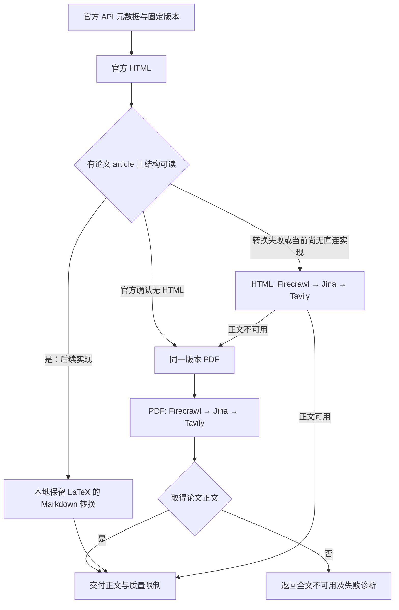

# arXiv 全文获取实测：URL、provider、token 与质量

> 实测日期：2026-09-26 UTC，provider 请求窗口 03:51–04:10；本机日期为 2026-09-25。环境：macOS arm64，forager 0.5.3。九篇独立论文，81 个基础组合；加上原生选项、版本对照、复测和一次元数据代理探测，共 **116 次调用预算计数**，不超过 120。这里只报告这个时间窗口的观测，不给出总体服务可靠性排名。
>
> **实测**来自 `/tmp/arxiv-fetch-bench/`；**文档声称**引用官方资料；**建议／推断**不代表已实现行为。本次没有修改代码、配置、Cargo 文件或 ADR，也没有提交 Git。

## 结论先行

1. **正文 URL 顺序：固定同一版本的 `html/<id> → pdf/<id>`。`abs/<id>` 是元数据／发现入口，不能作为“已取得全文”的末级成功。**八篇有 HTML，一篇旧式 `hep-th/9711200` 没有。2012、2014、2017 年论文也能有 HTML，不能按年份跳过。旧论文 HTML 的说明页会误过现有薄正文门；必须在平台层识别“无 HTML”，直接转 PDF。
2. **现有请求形态下，全文质量优先的 arXiv 顺序推荐 `Firecrawl → Jina → Tavily`，选择方案 B。**Firecrawl 取得 8/8 可用 HTML，保留全部主图表说明；Tavily basic 的七次 HTML 正文成功均缺失参考文献条目，并大量漏图注。Jina 基础形态首轮只有 3/8 可用 HTML 成功，但三个成功样本的公式较干净，PDF 为 9/9，适合第二顺位。这个排序优先保留正文证据，**不是费用最低的排序**。
3. **最值得继续实现的路线是官方 HTML 直连＋了解 arXiv MathML 的本地转换。**八篇全部可读，抽查 LaTeX 40/40 保留，主图表说明完整；保留 LaTeX、仅保留链接文字的版本合计 238,640 token，比 Firecrawl HTML 的 291,257 少 **18.1%**，没有第三方抓取费。本轮端到端估计中位数 1.65 秒。原型仍有嵌套表头、公式布局表和 Markdown 渲染问题，值得做专属 adapter，尚不能把通用转换器当成熟替代品。
4. **可选的省 token 阅读档：Jina 加 `X-Target-Selector: article.ltx_document` 和 `X-Retain-Links: text`。**五篇补测都取得正文，合计比同篇 Firecrawl 少 **24.1%**，保留抽查公式和图注；但会压平部分表格、删除链接目标。不适合直接把表格数值交给量化计算，也不应静默替代保留出处的默认档。
5. **不选择 C。**本轮只测 arXiv，无法支持调整所有网站的全局链。A 是零架构改动的最小方案，但它把较短且缺图注、缺参考文献的 Tavily HTML 当作成功，不能满足严格全文默认值。B 需显式修订 ADR 0009；仅换排序仍不能解决“说明页误成功”。

## 方法与执行边界

先用 Mixtral 与旧式 hep-th 做 18 个基础组合和 8 个选项探索，再扩展其余七篇；基础矩阵为 **9 篇 × 3 URL × 3 provider = 81**。随后做受控请求头对照、缓存对照和版本配对。所有请求由同一个执行流程串行发出；前一个请求结束后至少等待 3.2 秒，重定向也分开等待。没有并行 arXiv 抓取。第三方内部缓存、重试和连接实现不可观测，因此这一约束的审计范围是本机发出的请求。

forager 通过环境变量单独选择 provider，`retry.max_attempts=1`，每家只向该次子进程提供配置中的首个凭据，防止重试和轮换扩大调用数；配置文件未变。`--timeout 120` 是 CLI 总预算，Firecrawl 请求体仍为 `timeout: 60000`。原生请求不自动重试，客户端等待上限 150 秒。选项阶段是定向实验，并未穷举每篇 × 每 URL × 每种选项；没有在表中列出的组合均未测。三次瞬时 Network 记录和被拒绝的请求也计入 116 的上限；它不是发票上的收费成功次数。

计数拆分：基础 CLI 81，版本配对 CLI 6，Jina 同形复测 2，原生选项 26，Jina 代理 Query API 探测 1。官方 HTML/PDF、OAI-PMH、源码及公开文档的直接 GET 不消费这三家的调用额度。本地转换共 25 个结果：8 × 3 个 markdownify 配置，另加一次 Pandoc 探索。

### 论文存在性与版本

`export.arxiv.org/api/query` 本轮多次返回 406 空体或 429；一次经 Jina 的探测返回 422。没有把这些失败解释为论文不存在，也没有把它们混入正文 provider 成功率。改用 **arXiv 官方 OAI-PMH GetRecord API**，九篇全部返回 HTTP 200、正确 ID、标题、摘要和分类，原始 XML 已保存。OAI-PMH 是官方 API，但**这不是 Query API 成功验证**；平台设计中的 Query API 可用性仍需独立解决。[官方 OAI-PMH 文档](https://info.arxiv.org/help/oa/index.html)

OAI-PMH 用于核实论文存在，返回当前记录，不能证明它的摘要就是某个旧版本的摘要。质量对照优先使用所请求版本的官方 HTML 摘要；无 HTML 的 hep-th 使用官方 API 摘要并与 PDF 首页核对。固定版本的存在性另由官方 PDF/HTML HTTP 200 和 PDF 的 arXiv 版本戳确认。以下页数均由官方 PDF 实际解析得到。

| 样本 | 请求 ID | 官方 API 标题 | 覆盖类别 | PDF 页数 | 直接 HTML | PDF 版本 |
|---|---|---|---|---|---|---|
| S1 | [2401.04088](https://arxiv.org/abs/2401.04088) | Mixtral of Experts | 新 HTML；表格密集 | 13 | 是／200 | v1 |
| S2 | [hep-th/9711200](https://arxiv.org/abs/hep-th/9711200) | The Large N Limit of Superconformal Field Theories and Supergravity | 旧式 ID；无 HTML；hep 公式密集 | 22 | 否／404 | v3 |
| S3 | [2407.21783](https://arxiv.org/abs/2407.21783) | The Llama 3 Herd of Models | 新 HTML；超长；表格密集 | 92 | 是／200 | v3 |
| S4 | [2501.12948v1](https://arxiv.org/abs/2501.12948v1) | DeepSeek-R1: Incentivizing Reasoning Capability in LLMs via Reinforcement Learning | 新 HTML；固定版本；表格／公式 | 22 | 是／200 | v1 |
| S5 | [1706.03762](https://arxiv.org/abs/1706.03762) | Attention Is All You Need | 旧论文；有 HTML；公式／表格 | 15 | 是／200 | v7 |
| S6 | [1406.2661](https://arxiv.org/abs/1406.2661) | Generative Adversarial Networks | 旧论文；有 HTML；公式 | 9 | 是／200 | v1 |
| S7 | [2308.11294v1](https://arxiv.org/abs/2308.11294v1) | Network Momentum across Asset Classes | q-fin.PM/TR；固定版本；量化表格 | 32 | 是／200 | v1 |
| S8 | [1208.2775v5](https://arxiv.org/abs/1208.2775v5) | Physical approach to price momentum and its application to momentum strategy | q-fin.GN/PM；固定版本；公式 | 23 | 是／200 | v5 |
| S9 | [2303.10798](https://arxiv.org/abs/2303.10798) | An aperiodic monotile | math.CO/MG；超长；图形与证明 | 91 | 是／200 | v3 |

S1 另测 `2401.04088v1` 的 HTML/PDF × 三家，用于与无版本 URL 配对；不把它计为第十篇独立论文。

### 每个评价维度怎样测量

| 维度 | 方法与边界 |
|---|---|
| 成功与错误 | 记录退出码、provider HTTP status、ErrorKind、原生失败体；正文人工区分论文 P、摘要 M、无 HTML 说明页 E、base64 B64。原生结果另外套用现有薄正文阈值。provider HTTP 200 不等于源站 200，也不等于论文正文。 |
| 延迟 | Python perf_counter 围住一次 CLI 子进程或原生 HTTP 往返，单位秒，含启动／网络／provider 处理。每格一次，报告单次值与组内中位数；不计 3.2 秒礼貌等待。缓存没有统一清空，不能当冷启动排名或 p95。 |
| 输出规模 | 只计解码后的正文，Unicode 字符数和 UTF-8 字节数分别记录；token 使用 tiktoken 0.14.0 的 cl100k_base，不是字符估算。原生 JSON 包装不计入。 |
| 完整度 | 以官方 HTML 全部各级标题、章节首尾段落锚点、主图表说明、参考文献条目为清单，结合 PDF 目录与人工核对结论、附录。标题匹配先去除 Markdown 链接目标，避免 URL title 属性制造假命中。H 包含摘要、Contents、References 和定理／Proof 标题，不等于一级章节数。 |
| 摘要 | 规范化 Unicode 与空白后，计算官方摘要连续五词片段在输出可见文本中的命中率 A。公式、连字符、排版变化会降低数值，低于 100% 不直接等于摘要遗漏；这是字面覆盖诊断。 |
| 图注与参考文献 | C 对主 Figure/Table 说明的前至多 12 个规范化词做匹配，遇到 MathML 截止；不计重复的子图 (a)/(b) 标签。R 对各参考文献条目取首部文字锚点。C/R 是可复核下界，涉及公式转写或断行时人工复核。 |
| 噪声 | 检查五类导航／反馈标记；重复率为 1－唯一非空行数/非空行数。参考文献 token 占比按 References 至下一正文标题／反馈区估算，并用条目锚点校验；仅有空标题记 0。参考文献是证据而非天然噪声，不能靠删除它制造“更高效率”。 |
| 公式 | 每篇有 HTML 的论文选去重后最长的五个非平凡 LaTeX alttext，去空白及 Markdown 下划线转义后核对原串；另人工比较 Mixtral 公式和 hep-th PDF 第 4 页公式 (2.2)–(2.5)。精确串匹配不是数学等价验证，也不证明整篇所有公式正确。 |
| 表格与图 | 人工对照 Mixtral PDF 第 4 页 Table 2 的 14 列及样例数据，检查 q-fin 表格的行列关系、复合表头、符号与图注。Markdown 竖线行数仅是结构信号，不能把公式布局表算作数据表成功。未做图片语义理解。 |
| 截断 | 检查 forager 成功诊断和正文大小，区分 4 MiB 截断与 provider 自身漏提取。本轮未出现 forager 截断诊断；最大的正常正文约 427 KB。不能据此声称超过 4 MiB 的行为已验证。 |
| 成本 | 采用公开 credit/token 规则做摊销估算，并交叉读取原生响应 usage/creditsUsed；不读取账户账单，不假设免费余额或真实套餐。详见费用表。 |

工具固定为 Python 3.12.13、beautifulsoup4 4.15.0、markdownify 1.2.3、PyMuPDF 1.28.2、requests 2.34.2、tiktoken 0.14.0；依赖仅安装到 `/tmp/arxiv-fetch-bench/venv`。PDF 渲染抽查包含 Mixtral 的公式／表格页、hep-th 第 4 页和 q-fin 页面，图片未写入仓库。

## 基础结果矩阵：现有 forager 请求

每格格式为 **状态 字符数 / token / 秒**。P＝取得论文主体，仍需看后面的质量表；M＝仅元数据；E＝错误说明页却被 CLI 接受；Q＝CLI 的 Quality；N＝Network。Q/N 的 0 是 CLI 没有交付正文，不代表响应体一定为空。除 N 未取得 HTTP status 外，本表 provider attempt 均报告 HTTP 200；E 的官方源站直连状态实际为 404。所有组合均实际运行。

| 样本 | URL | Tavily basic | Firecrawl scrape | Jina 当前形态 |
|---|---|---|---|---|
| S1 | html | P 25,726 / 8,289 / 3.61 | P 38,843 / 12,071 / 2.90 | Q 0 / 0 / 6.66 |
| S1 | pdf | P 32,118 / 9,216 / 3.37 | P 28,778 / 7,844 / 2.31 | P 32,594 / 9,319 / 3.24 |
| S1 | abs | M 10,535 / 3,204 / 2.24 | M 8,780 / 2,669 / 1.91 | M 10,535 / 3,204 / 1.10 |
| S2 | html | Q 0 / 0 / 2.75 | E 307 / 72 / 2.25 | E 1,847 / 500 / 3.98 |
| S2 | pdf | P 49,536 / 14,930 / 2.89 | P 58,984 / 19,450 / 15.87 | P 50,653 / 14,713 / 2.04 |
| S2 | abs | M 2,169 / 629 / 2.23 | M 7,319 / 2,208 / 1.88 | M 9,049 / 2,726 / 3.96 |
| S3 | html | P 287,681 / 75,204 / 3.03 | P 422,545 / 118,424 / 3.04 | Q 0 / 0 / 6.73 |
| S3 | pdf | P 359,930 / 92,262 / 3.30 | P 325,019 / 86,726 / 3.79 | P 359,930 / 92,262 / 9.82 |
| S3 | abs | M 53,366 / 17,431 / 3.10 | M 51,500 / 16,877 / 2.11 | M 53,366 / 17,431 / 1.17 |
| S4 | html | Q 0 / 0 / 3.24 | P 65,671 / 18,828 / 2.32 | Q 0 / 0 / 10.77 |
| S4 | pdf | P 56,783 / 15,655 / 3.07 | P 54,963 / 15,366 / 2.72 | P 57,463 / 15,912 / 1.55 |
| S4 | abs | N 0 / 0 / 0.02 | M 21,587 / 7,065 / 2.62 | M 23,468 / 7,634 / 1.12 |
| S5 | html | P 36,672 / 10,648 / 3.94 | P 49,328 / 14,291 / 3.19 | Q 0 / 0 / 4.16 |
| S5 | pdf | P 39,566 / 9,517 / 2.81 | P 44,935 / 12,892 / 2.27 | P 40,580 / 10,223 / 1.17 |
| S5 | abs | M 10,302 / 3,167 / 2.40 | M 8,567 / 2,650 / 1.53 | M 10,302 / 3,167 / 1.15 |
| S6 | html | P 29,147 / 9,253 / 4.09 | P 39,448 / 12,340 / 3.10 | Q 0 / 0 / 3.32 |
| S6 | pdf | P 29,006 / 7,257 / 5.37 | P 30,206 / 7,700 / 2.15 | P 29,548 / 7,315 / 2.29 |
| S6 | abs | M 1,777 / 503 / 3.73 | M 7,057 / 2,068 / 3.16 | M 8,799 / 2,599 / 1.12 |
| S7 | html | P 84,965 / 24,022 / 5.84 | P 101,472 / 29,135 / 3.31 | P 106,136 / 28,919 / 2.00 |
| S7 | pdf | P 76,704 / 19,118 / 3.42 | P 78,332 / 20,686 / 2.88 | P 77,599 / 19,490 / 2.64 |
| S7 | abs | M 1,873 / 517 / 2.95 | M 7,504 / 2,121 / 2.58 | M 9,260 / 2,664 / 2.03 |
| S8 | html | P 65,423 / 19,650 / 5.19 | P 74,760 / 22,635 / 2.77 | P 77,103 / 22,057 / 2.91 |
| S8 | pdf | Q 0 / 0 / 3.03 | P 68,848 / 20,579 / 2.91 | P 62,620 / 17,603 / 2.45 |
| S8 | abs | M 2,121 / 592 / 2.51 | M 7,159 / 2,187 / 1.96 | M 8,885 / 2,710 / 2.36 |
| S9 | html | P 149,436 / 45,801 / 9.83 | P 199,922 / 63,533 / 4.81 | P 192,527 / 54,699 / 3.96 |
| S9 | pdf | P 153,782 / 40,478 / 3.84 | P 159,865 / 44,265 / 3.11 | P 156,234 / 41,519 / 3.83 |
| S9 | abs | M 2,268 / 653 / 2.19 | M 8,379 / 2,585 / 2.68 | M 10,214 / 3,129 / 2.15 |

基础形态：Tavily `basic + markdown`、无 query；Firecrawl `/v2/scrape`、Markdown、`onlyMainContent:true`、`timeout:60000`；Jina `Accept:application/json`、`X-Return-Format:markdown`，读取 `data.content`，不删链接。后一个请求头来自当前 adapter；对照不能忽略它。参照 [ADR 0009](../adr/0009-provider-first-web-fetch-content-contract.md)、[架构约束](../spec/forager/04-architecture.md)。

| URL | provider | CLI 成功 | 论文主体取得 | 延迟中位数 s | 全部输出 token |
|---|---|---|---|---|---|
| html | tavily | 7/9 | 7/9 | 3.94 | 192,867 |
| html | firecrawl | 9/9 | 8/9 | 3.04 | 291,329 |
| html | jina | 4/9 | 3/9 | 3.98 | 106,175 |
| pdf | tavily | 8/9 | 8/9 | 3.30 | 208,433 |
| pdf | firecrawl | 9/9 | 9/9 | 2.88 | 235,508 |
| pdf | jina | 9/9 | 9/9 | 2.45 | 228,356 |
| abs | tavily | 8/9 | 0/9 | 2.40 | 26,696 |
| abs | firecrawl | 9/9 | 0/9 | 2.11 | 40,430 |
| abs | jina | 9/9 | 0/9 | 1.17 | 45,264 |

HTML 只按“官方确有 HTML”的八篇计算，Tavily 7/8、Firecrawl 8/8、Jina 3/8。两家对缺失 HTML 的成功和所有 abs 成功均不算全文。不同组的输出 token 总和受失败数量影响，**不能用 Jina 首轮合计较小来宣布它更省 token**。

### 完整度与内容边界

HTML 表中每格是 **H 标题 / C 主图表说明 / R 参考文献条目** 的命中数。所有 provider 都可能存在题注、数学标题的格式变体；例如 Firecrawl S4/S7 少的是 Contents，不能解释为一章研究正文丢失。S9 中 H/T 变量的重复转写造成部分标题不匹配，人工确认相应证明与附录还在。

| 样本 | Tavily basic H/C/R | Firecrawl H/C/R | Jina 首轮 H/C/R | 本地 math_text H/C/R |
|---|---|---|---|---|
| S1 | 13/13；0/15；0/35 | 13/13；15/15；35/35 | 0/13；0/15；0/35 | 13/13；15/15；35/35 |
| S3 | 104/104；0/65；0/277 | 104/104；65/65；277/277 | 0/104；0/65；0/277 | 104/104；65/65；277/277 |
| S4 | 0/43；0/9；0/39 | 42/43；9/9；39/39 | 0/43；0/9；0/39 | 43/43；9/9；39/39 |
| S5 | 30/30；0/9；0/40 | 30/30；9/9；40/40 | 0/30；0/9；0/40 | 30/30；9/9；40/40 |
| S6 | 18/18；0/5；0/31 | 18/18；5/5；31/31 | 0/18；0/5；0/31 | 18/18；5/5；31/31 |
| S7 | 31/31；0/15；0/46 | 30/31；15/15；46/46 | 31/31；15/15；46/46 | 31/31；15/15；46/46 |
| S8 | 17/17；0/5；0/48 | 17/17；5/5；48/48 | 17/17；5/5；48/48 | 17/17；5/5；48/48 |
| S9 | 38/42；2/84；0/49 | 38/42；84/84；47/49 | 41/42；84/84；45/49 | 41/42；84/84；45/49 |

**Tavily basic 的短输出不是等质量压缩。**七篇成功 HTML 均有 References 标题但条目锚点为 0；Mixtral、Llama 3、Attention、GAN、两篇 q-fin 的主图表说明也全部未命中，S9 仅 2/84。人工查看确认典型 References 后直接出现页面反馈内容，或直接进入附录。章节标题全部出现仍不能证明全文完整。

Firecrawl HTML 的主图表说明合计全部保留；S9 参考文献 47/49 的锚点差异涉及格式／文本表示，未将其直接定性为两条文献整条缺失。Jina 成功的三个 HTML 样本也有较完整的图注与文献，但仍包含反馈区。

PDF 质量表每格是 **H 标题命中；A 摘要五词片段命中百分比；C 图表说明命中**。它反映提取差异，不等于全文语义准确率。

| 样本 | Tavily PDF | Firecrawl PDF | Jina PDF |
|---|---|---|---|
| S1 | 13/13；97.4% A；15/15 | 13/13；93.2% A；10/15 | 13/13；97.4% A；15/15 |
| S2 | 12/12；87.4% A；— | 12/12；93.1% A；— | 12/12；87.4% A；— |
| S3 | 104/104；99.4% A；62/65 | 99/104；99.4% A；58/65 | 104/104；99.4% A；62/65 |
| S4 | 43/43；96.9% A；9/9 | 39/43；100.0% A；8/9 | 43/43；96.9% A；9/9 |
| S5 | 30/30；100.0% A；9/9 | 30/30；100.0% A；8/9 | 30/30；100.0% A；9/9 |
| S6 | 18/18；66.5% A；5/5 | 18/18；70.1% A；5/5 | 18/18；65.3% A；5/5 |
| S7 | 31/31；100.0% A；15/15 | 31/31；98.2% A；15/15 | 31/31；100.0% A；15/15 |
| S8 | 0/17；0.0% A；0/5 | 17/17；84.0% A；5/5 | 17/17；84.0% A；5/5 |
| S9 | 41/42；100.0% A；84/84 | 40/42；100.0% A；83/84 | 41/42；100.0% A；84/84 |

结论与附录的人工检查：所有取得论文主体的基础 PDF 都能定位末段 Conclusion/Discussion 或对应终章；S2 Appendix、S4 Appendix、S5 Attention Visualizations、S7 Appendix A、S9 Appendices A/B 均可定位。Tavily S8 PDF 未取得正文。HTML 成功输出也有这些尾部区块，但 Tavily 缺文献／图注，不能标成无损全文。S1/S3/S6/S8 没有同名独立 Appendix 标题，不要求凭空出现附录。

S6 摘要包含概率符号与下标，HTML 自身同时含 MathML 可见串和 TeX annotation；所有路径的字面 A 都受公式表示影响。其低于 100% 的 A 不能单独证明摘要漏了一段。PDF 的段落顺序、公式细节和表格数据还须人工复核，H 全中也不够。

## 原生选项、复测与版本配对

原生 Jina 的 `default/text/direct_text/browser_text` **不发送** `X-Return-Format`；`legacy*` 才与 forager 一样发送 `X-Return-Format:markdown`。因此最初的 text 成功不能独自证明“删链接修好了 forager”。补做 legacy 控制及同形 CLI 复测后，才分离这些因素。

选项缩写：`text`＝`X-Retain-Links:text`；`direct/browser`＝对应 `X-Engine`；`target`＝`X-Target-Selector:article.ltx_document`；`legacy`＝`X-Return-Format:markdown`。Firecrawl `pdf/no_pdf` 分别是 `parsers:["pdf"]`／`parsers:[]`；`fresh` 另加 `maxAge:0`。Tavily advanced 不传 query，`timeout:60`、`include_usage:true`。Q* 表示原生 HTTP 成功，但套用 forager 薄正文门会失败。

| 序号 | ID | URL | provider | 选项 | HTTP | 状态 字符 / token / 秒 |
|---|---|---|---|---|---|---|
| 19 | 2401.04088 | html | jina | text | 200 | P 30,631 / 8,293 / 1.34 |
| 20 | 2401.04088 | html | jina | direct_text | 200 | P 30,631 / 8,293 / 1.34 |
| 21 | 2401.04088 | html | jina | browser_text | 200 | P 30,631 / 8,293 / 1.22 |
| 22 | 2401.04088 | html | tavily | advanced | 200 | P 41,735 / 12,450 / 5.29 |
| 23 | 2401.04088 | pdf | firecrawl | pdf | 200 | P 29,110 / 8,026 / 2.03 |
| 24 | 2401.04088 | pdf | firecrawl | no_pdf | 200 | P 29,110 / 8,026 / 1.87 |
| 25 | hep-th/9711200 | pdf | jina | text | 200 | P 50,653 / 14,713 / 1.60 |
| 26 | hep-th/9711200 | pdf | tavily | advanced | 200 | P 49,536 / 14,930 / 2.94 |
| 91 | 2401.04088 | html | jina | default | 200 | P 34,649 / 9,819 / 1.10 |
| 92 | 2401.04088 | html | jina | legacy | 200 | P 41,735 / 12,450 / 1.21 |
| 93 | 2401.04088 | html | jina | legacy_text | 200 | P 35,538 / 10,226 / 1.26 |
| 94 | 2401.04088 | html | jina | legacy_target | 200 | P 37,026 / 11,107 / 1.13 |
| 95 | 2401.04088 | html | jina | legacy_target_text | 200 | P 33,008 / 9,581 / 1.15 |
| 96 | 2407.21783 | html | jina | legacy_target_text | 200 | P 362,696 / 94,195 / 2.29 |
| 97 | 2501.12948v1 | html | jina | legacy_target_text | 200 | P 58,633 / 15,737 / 1.26 |
| 98 | 2308.11294v1 | html | jina | legacy_target_text | 200 | P 82,686 / 21,124 / 1.47 |
| 99 | 2303.10798 | html | jina | legacy_target_text | 200 | P 160,200 / 43,075 / 2.16 |
| 100 | 2407.21783 | html | tavily | advanced | 200 | P 287,681 / 75,204 / 4.99 |
| 101 | 2308.11294v1 | html | tavily | advanced | — | N 0 / 0 / 0.02 |
| 102 | 2303.10798 | html | tavily | advanced | 200 | P 192,527 / 54,699 / 7.58 |
| 103 | 2401.04088 | pdf | firecrawl | no_pdf_fresh | 200 | B64 3,301,320 / 2,296,358 / 3.65 |
| 104 | 2401.04088 | pdf | firecrawl | pdf_fresh | 200 | P 28,778 / 7,844 / 3.48 |
| 105 | 2401.04088v1 | html | tavily | cli_version | 200 | P 25,726 / 8,289 / 4.02 |
| 106 | 2401.04088v1 | html | firecrawl | cli_version | 200 | P 38,959 / 12,187 / 3.18 |
| 107 | 2401.04088v1 | html | jina | cli_version | 200 | Q 0 / 0 / 4.18 |
| 108 | 2401.04088v1 | pdf | tavily | cli_version | 200 | Q 0 / 0 / 4.72 |
| 109 | 2401.04088v1 | pdf | firecrawl | cli_version | None | N 0 / 0 / 0.03 |
| 110 | 2401.04088v1 | pdf | jina | cli_version | 200 | P 32,594 / 9,319 / 3.20 |
| 111 | 2401.04088 | html | jina | cli_repeat | 200 | P 41,735 / 12,450 / 1.25 |
| 112 | 2501.12948v1 | html | jina | cli_repeat | 200 | P 81,717 / 23,245 / 1.40 |
| 113 | 2308.11294v1 | html | tavily | advanced_retry | 200 | P 106,136 / 28,919 / 4.34 |
| 114 | 2401.04088 | html | jina | legacy_direct_text | 200 | P 35,538 / 10,226 / 0.75 |
| 115 | 2401.04088 | html | jina | legacy_browser_text | 200 | P 35,538 / 10,226 / 1.20 |
| 116 | 2501.12948v1 | html | tavily | advanced | 200 | Q* 94 / 26 / 2.49 |

这些补充项共 34 次；另一次 #27 是 Query API 元数据代理探测（Jina，HTTP 422，16.08 秒），没有正文，不计入上述内容质量比较。矩阵保留了网络失败，未用复测覆盖首轮失败。

### 选项能带来什么

- **Jina 链接控制有可测收益。**同一暖缓存 S1，legacy 为 12,450 token，legacy_text 为 10,226，减少 **17.9%**；再加 article selector 为 9,581。五篇 legacy_target_text 合计 183,712，对应 Firecrawl 241,991，少 24.1%。五篇主图表说明与抽查 LaTeX 均保留，但部分表格被压平。`text` 留下锚文字和引用编号、删除链接目标；论文主 URL 可以单独保留，文献和图片的逐项可追溯性仍有损失。
- **Jina 引擎没有决出胜者。**S1 的 native text/direct_text/browser_text 三份内容相同；legacy_text、legacy_direct_text、legacy_browser_text 也相同。时间为暖缓存单次观测，不能推断 direct 在冷缓存更快或 browser 更可靠。官网 OpenAPI 列 direct/browser/cf-browser-rendering，GitHub README 此时却写 curl/browser/auto，名称存在文档差异；本轮按托管 OpenAPI 测 direct，未测 curl 或 Cloudflare 引擎。[OpenAPI](https://r.jina.ai/openapi.json)、[README](https://github.com/jina-ai/reader/blob/main/README.md)
- **Jina 初次失败是可恢复现象，根因未证实。**S1 首次 Quality，稍后相同 CLI 变为 12,450 token；S4 也从 Quality 恢复为 23,245 token。可能涉及缓存、源站或解析路径，不能把恢复归功于已改变的某个选项。article selector 在五篇后测成功，但没有五篇独立冷缓存配对，不能给出因果成功率。
- **Tavily advanced 不是统一升级。**S1 从 8,289 增至 12,450 token，补回 15 条图表说明、文献和干净 LaTeX；S7 成功复测为 28,919，补回图注／文献；S9 为 54,699，也有改善。S3 与 basic **内容完全相同**，仍漏图注与文献；S4 只返回 94 字符的图像描述，按薄正文门仍失败。S2 PDF advanced 与 basic 内容相同。官方声称 advanced 更适合表格与嵌入内容，但本轮不支持无条件开启。[Tavily Extract](https://docs.tavily.com/documentation/api-reference/endpoint/extract)
- **Firecrawl PDF 必须开启解析。**S1 首次 `parsers:[]` 命中缓存仍返回 8,026 token Markdown；加入 `maxAge:0` 后变成 3,301,320 字符、**2,296,358 token 的单行 base64**。其原生 metadata 计 1 credit。启用 pdf 并 fresh 后为 7,844 token，13 页／13 credits。base64 小于 4 MiB，又远超过 PDF 长度门，因此长度门不能把它识别为非正文。不要把禁用解析当作省钱的全文选项。[Scrape 参数](https://docs.firecrawl.dev/api-reference/endpoint/scrape)
- **版本必须固定，但固定版本不保证缓存相同。**S1 bare/v1 的 Tavily HTML 完全相同，Firecrawl 多 116 token，差异主要是链接中增加 v1；Jina PDF 完全相同。v1 的 Tavily PDF 失败，Firecrawl PDF 为瞬时 Network；未据此宣称版本 URL 本身不受支持。记录请求版本，失败时不要悄悄改为最新版。

## 公式、表格、噪声与 token 效率

### 公式和表格实物检查

HTML 的普通转换会把 MathML 显示文本和 TeX annotation 同时输出。例如 `n` 变为 `nn`；Firecrawl 还会对 TeX 反斜线再次转义。它的八篇 HTML 精确 TeX 样本均为 0/5，但这表示 **TeX 原串被转义／混排**，不是所有公式信息消失。Jina 成功 HTML／定向后测和本地 math 转换保留了被抽查的 TeX 原串；PDF 的 Tavily/Jina 则通常把分式、上下标压成线性字符。

对照 hep-th PDF 第 4 页，Tavily 输出含控制字符，分式分母与上标失去二维关系；Jina 同样把分式和上下标拆散。Firecrawl 恢复了 (2.2)–(2.5) 的 LaTeX 块，是本轮该类 PDF 的最好候选，但也把行内公式重复到独立块，并有普通文本错位。另外，Firecrawl 的 S1 PDF 结论把官方原文的 `Mixtral` 转成了 `Mixral`；S9 结论有一段开头重复。这些是具体的文字精度问题。它不是数学或逐字正确性的保证，计算或引用公式时仍应核对官方 PDF／源码。

Mixtral Table 2 有 14 列。Firecrawl 和本地转换保留了数据行的分隔，但 `Active Params` 的嵌套表头有破损。Jina text 和 Tavily advanced 在此处出现 `44.4%77.1%69.5%…`，数字值尚在却没有可靠列界。Tavily basic 的数据行结构更像表格，但漏掉 Table 2 说明。因而“有竖线”或“token 少”都不能作为量化表格可直接入库的判断。

### 噪声和参考文献占比

Tavily 成功 HTML 7/7 含反馈区标记，部分还有 base64 logo；Firecrawl 成功论文 HTML 8/8 未检出这五类标记；Jina 首轮成功论文 HTML 3/3 有反馈区。定向 article 与本地 article 转换不含这些页面区域。

下表为代表样本的 **参考文献 token 占比 / 重复非空行比例**。前者不是应自动删除的“废话比例”；后者会把合法重复表格分隔线、公式和图中坐标也算进去，仅是噪声线索。

| ID | URL | provider | 文献 token 占比估计 | 重复行 | 页面噪声标记 |
|---|---|---|---|---|---|
| 2401.04088 | html | tavily | 0.0% | 8.7% | Report GitHub Issue、Instructions for reporting errors |
| 2401.04088 | html | firecrawl | 23.4% | 6.3% | 未检出 |
| 2407.21783 | html | tavily | 0.0% | 3.9% | Report GitHub Issue、Instructions for reporting errors |
| 2407.21783 | html | firecrawl | 26.9% | 8.1% | 未检出 |
| 2308.11294v1 | html | tavily | 0.0% | 12.1% | Report GitHub Issue、Instructions for reporting errors |
| 2308.11294v1 | html | firecrawl | 8.0% | 10.3% | 未检出 |
| 2308.11294v1 | html | jina | 7.8% | 6.2% | Report GitHub Issue、Instructions for reporting errors |
| hep-th/9711200 | pdf | tavily | 19.1% | 0.0% | 未检出 |
| hep-th/9711200 | pdf | firecrawl | 未可靠分界 | 39.6% | 未检出 |
| hep-th/9711200 | pdf | jina | 19.4% | 14.1% | 未检出 |
| 1706.03762 | pdf | tavily | 28.3% | 3.0% | 未检出 |
| 1706.03762 | pdf | firecrawl | 26.2% | 28.6% | 未检出 |
| 1706.03762 | pdf | jina | 31.4% | 57.1% | 未检出 |

Firecrawl 的 hep-th PDF 文献标题未被可靠识别，所以该占比留空，没有编造为 0。S9 图形论文和 Attention 可视化页的重复数字也会抬高 PDF 重复行比例，不能据此自动删除行。

### 官方 HTML 直连与本地转换

本轮直接 GET 八篇 HTML 均为 200，有 `article.ltx_document`；hep-th 为 404 且没有该节点，直接拒绝转换。没有浏览器渲染、图片下载或第三方请求。比较三种方案：

- `generic`：选择 article、绝对化链接，直接 markdownify；会重复 MathML 与 annotation。
- `math`：先用每个 `<math>` 的 `alttext` 或 TeX annotation 替换成 `$…$`／`$$…$$`，再转 Markdown，保留链接。
- `math_text`：在 math 基础上将 `<a>` 解包，仅保留链接文字；保留图片 URL 和参考文献文本。

每格为 **字符 / token / 本地转换秒**；网络 GET 和 HTML 解析单列。转换时间不包含 token 计数，端到端估计为 GET＋解析＋转换，未包括网络排队和礼貌等待。

| 样本 | GET s | 解析 s | generic | math | math_text |
|---|---|---|---|---|---|
| S1 | 1.247 | 0.026 | 38,287 / 11,934 / 0.057 | 38,147 / 11,808 / 0.047 | 34,300 / 10,318 / 0.047 |
| S3 | 1.326 | 0.120 | 417,145 / 117,574 / 0.342 | 417,322 / 117,358 / 0.327 | 374,554 / 100,418 / 0.300 |
| S4 | 1.454 | 0.059 | 69,405 / 19,836 / 0.065 | 69,017 / 19,468 / 0.053 | 59,989 / 16,337 / 0.061 |
| S5 | 1.225 | 0.025 | 48,491 / 13,986 / 0.070 | 47,674 / 13,271 / 0.060 | 41,953 / 11,105 / 0.046 |
| S6 | 1.175 | 0.027 | 38,279 / 11,949 / 0.084 | 37,252 / 10,851 / 0.036 | 33,204 / 9,277 / 0.035 |
| S7 | 1.544 | 0.062 | 103,719 / 29,887 / 0.151 | 102,315 / 28,679 / 0.126 | 86,623 / 23,160 / 0.125 |
| S8 | 2.161 | 0.045 | 73,655 / 22,166 / 0.150 | 72,620 / 21,178 / 0.103 | 67,471 / 19,244 / 0.091 |
| S9 | 2.064 | 0.234 | 196,621 / 62,045 / 0.683 | 194,212 / 58,952 / 0.495 | 167,129 / 48,781 / 0.544 |

额外探索：S1 的原始 article 直接交给 `pandoc -f html -t gfm --wrap=none`，得到 **153,738 字符、58,861 token、2.778 秒**，保留大量 HTML 属性和嵌套表格。这一配置不划算；它不是所有 Pandoc 配置的结论，也没有扩展至九篇。

本地 math_text 的八篇主图表说明与抽查公式均完整，S9 唯一未命中的标题是 `Cases with H H not adjacent to T T`：修复 MathML 重复后变成单个 H/T，实际章节仍在。普通 markdownify 仍会把公式外层布局表转成 Markdown 表格，且嵌套表头未完全修复。因此建议下一步做小型 arXiv 专属结构转换器：保留 TeX、正文、图注、脚注、文献和真实数据表，单独处理布局表；不要新增面向所有站点的语义降噪器。

## 单篇费用估算

以下为公开价格的**摊销边际估算**，不等于本账户实付。没有调用任何充值、套餐或账号修改接口。免费额度、税、老套餐、缓存收费和月度最低消费不纳入比较。

| provider | 公开规则与计价口径 | 本轮例子 |
|---|---|---|
| Tavily | basic 每 5 个成功 URL 1 credit，advanced 每 5 个成功 URL 2 credits；PAYG $0.008/credit。因此摊销 $0.0016/basic URL、$0.0032/advanced URL。按批次累计，单次 include_usage=0 不等于免费。 | 普通 13 页或 92 页 PDF 均按成功 URL 摊销；API 认为成功、但 forager 因薄正文拒绝时，仍可能计费。 |
| Firecrawl | 以公开 Hobby 加购 1,000 credits/$5，即 $0.005/credit 示意。HTML 约 1 credit。Scrape API 写 PDF 每页 1 credit；Billing 页写基础费另加 PDF 页费，存在一页基费口径差异，保守估计 P 至 P+1 credits。 | S1 原生解析响应实测 creditsUsed=13、numPages=13；估计 $0.065–0.070/篇。S2 22 页 $0.110–0.115；S3 92 页 $0.460–0.465。不能把所有 CLI PDF 的实际账单断言为页数。 |
| Jina | Reader 按输出 token；当前公开购买页 JS 选择 1B/$50 与 11B/$500 两档。本表以较保守 $0.05/百万 token 估算；老套餐不混用。若有 usage.tokens，优先采用该字段。 | S1 legacy_text 10,226 token 约 $0.00051；S3 PDF 92,262 token 约 $0.00461。cl100k_base 与本次所读 native usage 一致，但不把该一致性外推给所有模型／选项。 |
| 直接 GET＋本地 | 三家 API 费用为 0；仍有本机计算、带宽、维护及下游 LLM 输入费用。 | 同样的正文 token 进入下游 LLM 仍收费；少 18.1% token 是八篇与 Firecrawl 的实测比较，不是端到端总费用节省比例。 |

依据：[Tavily credits](https://docs.tavily.com/documentation/api-credits)、[Firecrawl billing](https://docs.firecrawl.dev/billing)、[Firecrawl scrape](https://docs.firecrawl.dev/api-reference/endpoint/scrape)、[Jina Reader](https://jina.ai/reader/)、[公开商品数据](https://dash.jina.ai/api/v1/product)。商品接口同时返回历史 SKU；这里仅使用 Reader 页面当前 JS 选择的两个 SKU，避免误用历史低价。

按本样本模拟 B：八篇 HTML 首选 Firecrawl，唯一缺 HTML 的 hep-th 用 Firecrawl PDF，约 30–31 credits，即 $0.150–0.155，共九篇。这是基于已观测结果的顺序模拟，**没有额外执行完整 fallback 链，也没有把它说成实付**。如果 HTML 缺失比例很高，PDF 页费会成为主要成本；纯阅读且预算优先时可显式先选 Jina PDF，再把公式／表格任务升级到 Firecrawl，不能将便宜的线性文本标成结构无损。

## 推荐与 A/B/C 取舍

### 推荐配置与处理顺序

**当前 provider 契约的推荐：方案 B，arXiv 使用 `Firecrawl → Jina → Tavily`；URL 外层保持 `HTML → PDF`，每个 URL 内执行 provider 链。**在当前配置、catalog 校验和 ADR 尚未变更前，这是提案，不是已经可以使用的配置键。拟议配置如下，仅作用于平台 arXiv 正文请求，普通 `forager fetch` 和其他平台仍遵循全局链：

```toml
# Proposal; not an existing configuration contract.
[platforms.arxiv]
content_order = ["firecrawl", "jina", "tavily"]
```

Tavily basic 不作为全文首选；Jina 放在第二位用于补齐可用性，并提供更干净的公式文本。公式／表格的特殊需要不能只靠链的第一个 HTTP 成功决定。

**后续最佳方向：在上述链前加入官方 HTML 直接 GET＋本地结构转换。**该路线需明确平台所有权、限流、版本、源码大小和解析质量契约；本轮只证明它值得实现，不是批准扩大公共 Web Fetch 的接口或默认降噪。



`abs` 只用于元数据、版本和全文链接发现，不在成功终点上。预算优先的 PDF 阅读档是显式覆盖，不要求现在再增加一层 MIME 专属全局顺序。

| 方案 | 判断 | 理由与代价 |
|---|---|---|
| A 复用 Tavily → Firecrawl → Jina | 最小可行过渡，不作为严格全文的最终默认 | 零排序架构成本；但 Tavily HTML 的有损输出会终止共享链。至少先做平台无 HTML／摘要页判定，明确交付的是尽力正文；否则旧论文甚至拿不到 PDF。 |
| B 平台声明专属正文顺序 | 推荐；首轮采用 Firecrawl → Jina → Tavily | 限定 arXiv、从 web_fetch catalog 校验；实测的 HTML 图注／文献边界差异足以支持局部覆盖。需修订 ADR 0009 的“不存在内容类型专属顺序”，明确平台 override 的生效范围、缺凭据行为和诊断；保持其他站点全局链不变。PDF 页费较高。 |
| C 全局改 Jina 优先 | 不推荐 | 只有 arXiv 数据，且 Jina 首轮 HTML 多次 Quality；后测成功不能代表稳定首选。会改变无关站点行为，收益没有本轮证据。 |

请求选项建议：

- Firecrawl 默认继续单次 `/scrape`、Markdown、`onlyMainContent:true`、`timeout:60000`，不增加 wait/actions。PDF 明确保留 `parsers:["pdf"]`。`maxAge:0` 只用于诊断选项或缓存异常，本轮不支持永久禁用缓存。
- Jina 保留 JSON 正文契约；arXiv HTML 可专属选择 `article.ltx_document`。默认保留链接，用户明确需要紧凑阅读时才启用 `X-Retain-Links:text`；本轮没有证据要求固定 `X-Engine`。对 PDF 不复用 HTML selector。
- Tavily 默认作为末级尽力文本；advanced 用于有据的再提取或明确选择，不能承诺修复所有表格。本轮不建议通过 query/chunks 节省 token，因为目标是全文。
- 下游需要公式计算或表格入库时，优先官方 HTML 的 TeX／表格结构，必要时对照 PDF 或 e-print；provider 给出长字符串不代表结构已验证。

### 已知失败形态与处理

| 实测失败形态 | 证据 | 建议 |
|---|---|---|
| 无 HTML 说明页被当成功 | S2 官方 HTML 404；Firecrawl 返回 307 字符／4 唯一行，Jina 1,847 字符，均 CLI 成功。 | 平台识别官方 No HTML 页面／缺论文结构，跳至同版本 PDF；不要继续把说明页当全文，也不要指望 200 字符门。 |
| abs 假全文 | 26/27 abs CLI 成功，但九篇均仅元数据；S3 abs 超过 17k token，长作者列表也能很长。 | abs 保留 metadata-only 语义；不能作为 PDF 失败后的成功降级。 |
| HTTP 200 薄片段 | Jina HTML 首轮 S1/S3/S4/S5/S6 分别被拒 154/75/224/191/27 字符；S4 的 224 字符命中密度线。Tavily S4 为 94 字符，S2 HTML 与 S8 PDF 为 0。 | 保留 Quality 和字符／唯一行诊断，按配置继续 provider 或 URL fallback。若有缓存变化证据，可做有预算的复测；不要无限重试。 |
| 看似完整但缺文献／图注 | Tavily basic 七篇 HTML 的 H 很高、R=0，C 通常=0。 | 把标题、章节与图表／文献分开检查；全文默认采用不同首选或专属解析。不可只调低／调高长度阈值解决。 |
| 瞬时传输失败 | S4 abs Tavily、S7 native advanced、S1v1 PDF Firecrawl 未取得 HTTP status，耗时 0.02 秒左右。 | 记 Network 而非论文不存在；在额度与 deadline 内有限重试。S7 advanced 一次复测成功，原失败仍留在矩阵。 |
| PDF 被当二进制文本 | 关闭解析且 fresh 后为 3.3MB base64，长度门会放过。 | 检查正文角色／响应类型，不以字符数判断；启用 PDF parser，不把 base64 交给模型。 |
| 缓存掩盖选项差异 | Firecrawl parsers:[] 的 cache hit 仍返回 Markdown，fresh 才出现 base64；Jina 引擎对照相同。 | 诊断时记录 cacheState、cachedAt、选项和请求时间；只对具体疑点绕过缓存，不把 warm 结果外推到 cold。 |
| 公式、表头与图中数字损伤 | hep-th PDF 的分式／上标线性化；Mixtral 嵌套表头和 Jina 数值粘连；Attention PDF 重复行 57.1%。 | 公式和表格用途另行校验；不要自动删除重复行或将松散文本直接解析为金融数据。 |
| 版本不一致与元数据限流 | 固定旧版本正文与 OAI 当前元数据不必相同；Query API 本轮 406/429。 | 固定并传递版本，独立记录 metadata/content 状态；对 429 尊重退避和三秒限速。OAI 验证不是 Query 请求成功的替代证明。 |
| 4 MiB 截断 | 本轮没有触发，仍是现有契约风险。 | 保留成功截断诊断与实际字节数；需要完整附录时分段取得或改走有界本地处理，不能把截断成功标成无损全文。 |

### 其他官方入口：e-print／src

两篇探索均由 `https://arxiv.org/e-print/<id>` 重定向到 `/src/<id>`，串行跟随后 HTTP 200。Mixtral 得到 2,878,415 字节 gzip/tar，17 个文件，其中 `.tex/.bbl` 两个；hep-th 得到 23,623 字节 gzip，解压为单个 67,624 字符 LaTeX 文件，而非 tar。没有执行 TeX 或源码中的任何命令，也没有下载其引用的外部资源。

源码适合核对公式、表格和章节，但宏、include、自定义样式、图片、参考文献构建和包依赖都可能影响转换；未经构建不能保证和 PDF 可见文本一致。**作为显式探索／证据补充保留，不加入默认 HTML→PDF 链**。真正实现时还需限制解压大小、路径和宏执行；本轮只读 tar 成员，未将包内路径写到磁盘。[Mixtral 官方源码](https://arxiv.org/src/2401.04088)、[hep-th 官方源码](https://arxiv.org/src/hep-th/9711200)

## 复现命令与原始证据

以下密钥变量均是占位符，需从本机配置在内存中读取；不要 echo、启用 shell trace、把认证头写到日志，或保存含密钥的请求转储。每次请求结束后等待至少 3 秒；不要把下面的命令并行运行。精确 Python 执行脚本、原始响应和派生指标在 `/tmp/arxiv-fetch-bench/`，没有放入仓库。

### 环境与基础矩阵

```bash
uv venv /tmp/arxiv-fetch-bench/venv
uv pip install --python /tmp/arxiv-fetch-bench/venv/bin/python \
  tiktoken==0.14.0 beautifulsoup4==4.15.0 markdownify==1.2.3 \
  pymupdf==1.28.2 requests==2.34.2

FORAGER_CAPABILITIES__WEB_FETCH__ORDER='["jina"]' \
FORAGER_RETRY__MAX_ATTEMPTS=1 \
forager fetch 'https://arxiv.org/html/2401.04088' \
  --format json --verbose --timeout 120
sleep 3.2
```

对表中九个请求 ID，依次替换 `html/pdf/abs` 以及 `tavily/firecrawl/jina`。为严格复现调用上限，执行器从配置读取每家首个凭据，仅通过子进程环境设置对应 `FORAGER_PROVIDERS__<NAME>__KEYS` 的 TOML 数组，不修改配置文件；不应把数组打印到命令日志。81 个组合只运行一次，补测单独命名。

### 官方存在性与正文

```bash
curl -sS --get 'https://export.arxiv.org/api/query' \
  --data-urlencode 'id_list=2401.04088' \
  --data-urlencode 'max_results=1'
sleep 3.2

# Official fallback used to verify existence in this run.
curl -sS --get 'https://oaipmh.arxiv.org/oai' \
  --data-urlencode 'verb=GetRecord' \
  --data-urlencode 'identifier=oai:arXiv.org:2401.04088' \
  --data-urlencode 'metadataPrefix=arXiv'
sleep 3.2

curl -sS 'https://arxiv.org/html/2401.04088' \
  -o /tmp/arxiv-fetch-bench/2401.04088.html
sleep 3.2
```

保存 HTTP status、响应类型、耗时和最终 URL；重定向不要用不带间隔的自动并行下载器。OAI 查询使用不带版本的 canonical ID，正文仍保留用户要求的版本。

### 原生选项

```bash
curl -sS 'https://r.jina.ai/https://arxiv.org/html/2401.04088' \
  -H "Authorization: Bearer $JINA_KEY" \
  -H 'Accept: application/json' \
  -H 'X-Return-Format: markdown' \
  -H 'X-Target-Selector: article.ltx_document' \
  -H 'X-Retain-Links: text'
sleep 3.2

curl -sS 'https://api.tavily.com/extract' \
  -H "Authorization: Bearer $TAVILY_KEY" \
  -H 'Content-Type: application/json' \
  -d '{"urls":["https://arxiv.org/html/2401.04088"],"format":"markdown","extract_depth":"advanced","timeout":60,"include_usage":true}'
sleep 3.2

curl -sS 'https://api.firecrawl.dev/v2/scrape' \
  -H "Authorization: Bearer $FIRECRAWL_KEY" \
  -H 'Content-Type: application/json' \
  -d '{"url":"https://arxiv.org/pdf/2401.04088","formats":["markdown"],"onlyMainContent":true,"timeout":60000,"parsers":["pdf"]}'
sleep 3.2
```

Jina 引擎对照分别增加 `X-Engine:direct` 或 `browser`，其余保持相同；要复现 native default 就同时去掉 `X-Return-Format`、target、text。Firecrawl 缓存诊断加 `"maxAge":0`；`parsers:[]` 会返回很大的 base64，不应作为日常阅读命令。只从 Jina `data.content`、Tavily `results[0].raw_content`、Firecrawl `data.markdown` 计正文 token。

### 最小本地转换与 token 计数

下面是 `math_text` 的核心，Python 完整执行器还记录耗时、HTTP 元数据和错误。省略 token 计数以外的结果不要误算成第三方输出。

```python
from pathlib import Path
from urllib.parse import urljoin
from bs4 import BeautifulSoup
from markdownify import markdownify
import tiktoken

url = "https://arxiv.org/html/2401.04088"
soup = BeautifulSoup(Path("/tmp/arxiv-fetch-bench/2401.04088.html").read_text(), "html.parser")
article = soup.select_one("article.ltx_document")
if article is None:
    raise ValueError("No paper article")
for node in article.select("math"):
    annotation = node.find("annotation", attrs={"encoding": "application/x-tex"})
    tex = node.get("alttext") or (annotation.get_text() if annotation else None)
    if tex:
        mark = "$$" if node.get("display") == "block" else "$"
        node.replace_with(mark + tex + mark)
for node in article.select("[href], [src]"):
    for attr in ("href", "src"):
        if node.has_attr(attr):
            node[attr] = urljoin(url, node[attr])
for node in article.select("a"):
    node.unwrap()
body = markdownify(str(article), heading_style="ATX", escape_underscores=False, escape_asterisks=False)
tokens = len(tiktoken.get_encoding("cl100k_base").encode(body, disallowed_special=()))
print({"characters": len(body), "utf8_bytes": len(body.encode()), "tokens": tokens})
```

`generic` 跳过 math 替换与 anchor 解包；`math` 只跳过 anchor 解包。PDF 页数和文字用 PyMuPDF 读取，图像抽查用 `page.get_pixmap()`。不执行论文 TeX。

### 文件约定与复核入口

- `bench.py`：凭据内存读取、串行限速、CLI/native 调用、token 计量；`paid_count` 为 116。
- `expand.py`、`supplement.py`、`final_calls.py`：样本扩展和追加组合；`official.py`：OAI 与源码；`local_convert.py`、`assess.py`、`report.py`：本地转换、质量指标与报告生成。
- `<ID>__<html|pdf|abs>__<provider>__<option>.json/.md/.row.json`：原始响应、解码正文、指标。ID 的 `/` 在文件名中替换为 `_`；失败可能没有 `.md`。
- `<ID>.html/.pdf/.pdf.txt/.pdf.info.json`、`oai-<ID>.xml`、`<ID>.source*`：官方基准与源码。`references.json` 存所有标题、锚点、摘要、公式样本、主图注与文献清单；`assessments.json` 存 140 个内容结果。
- `ledger.jsonl` 是增量执行记录；本地计量曾重新运行，因此本地条目可能重复。汇总以每个组合最终 `.row.json` 为准，不对 ledger 行数直接求成功率。
- `manifest.sha256` 提供原始正文、响应、脚本和评估数据的校验值；临时目录不是永久归档，清理后只能按这里的方法重新采样，不能保证 provider 缓存内容仍相同。

## 章节核对清单

下列列出官方 HTML 的一级标题；全部层级和段落锚点在 `references.json`，质量表 H 按全部层级计算。hep-th 的清单从 PDF 人工读取。图注、文献和源码另作交叉证据，不以“出现这些标题”代替完整度判断。

**S1 — 2401.04088**：1 Introduction；2 Architectural details；3 Results；4 Instruction Fine-tuning；5 Routing analysis；6 Conclusion；Acknowledgements；References。

**S2 — hep-th/9711200**：1 General idea；2 D3 branes or N=4 U(N) super-Yang-Mills；3 Other cases with 16→32 supersymmetries；4 Theories with 8→16 supersymmetries；5 Theories with 4→8 supersymmetries；6 Discussion, relation to matrix theory；7 Appendix；References。

**S3 — 2407.21783**：1 Introduction；2 General Overview；3 Pre-Training；4 Post-Training；5 Results；6 Inference；7 Vision Experiments；8 Speech Experiments；9 Related Work；10 Conclusion；Contributors and Acknowledgements；References。

**S4 — 2501.12948v1**：1 Introduction；2 Approach；3 Experiment；4 Discussion；5 Conclusion, Limitations, and Future Work；References；Appendix；Appendix A Contributions and Acknowledgments。

**S5 — 1706.03762**：1 Introduction；2 Background；3 Model Architecture；4 Why Self-Attention；5 Training；6 Results；7 Conclusion；References；Attention Visualizations。

**S6 — 1406.2661**：1 Introduction；2 Related work；3 Adversarial nets；4 Theoretical Results；5 Experiments；6 Advantages and disadvantages；7 Conclusions and future work；References。

**S7 — 2308.11294v1**：1 Introduction；2 Data；3 Network Momentum；4 Backtest；5 Robustness Analysis；6 Conclusion；References；Appendix A Appendix。

**S8 — 1208.2775v5**：1 Introduction；2 Theoretical background；3 Application to real data；4 Results；5 Factor analysis；6 Conclusion；Acknowledgement；Reference；References。

**S9 — 2303.10798**：1 Introduction；2 The hat polykite and its tilings；3 Aperiodicity via coupling of polyiamond tilings；4 Clustering of tiles；5 A four-tile substitution system；6 A family of aperiodic monotiles；7 Conclusion；Acknowledgements；Appendix A Aligned and unaligned tilings of polyforms；Appendix B Case analysis for 1 1 -patches；References。

## 局限与适用范围

这是九篇目的性取样、单机、单次窗口的小基准，偏向英文、可解析 LaTeX、知名 CS 论文与两篇 q-fin；不是随机样本，没有扫描 PDF、非英文、撤稿或大规模反爬情形。只有一篇缺 HTML，不能估计全库 HTML 覆盖率；旧论文有 HTML 的比例尤其不能外推。

provider 请求按固定顺序串行，缓存和源站状态没有随机化；Jina 选项在后测中受暖缓存影响。基础成功率保留首轮值，恢复情况另列，不能把五次定向后测成功宣传为生产成功率 100%。HTTP/CLI 成功、章节字面覆盖、完整正文、公式正确性和表格可计算性是不同指标。

参考文献和图注锚点是字面下界，数学表达、Unicode、跨行连字符会产生假阴性；重复行率和参考文献占比也不是自动清理规则。未逐个核对全部数值、全部公式或每幅图，不能把论文用于投资回测的数据正确性视作已验证。成本只有公开规则估算，没有核对真实扣费账单。

Query API 在本轮失败；九篇存在性由官方 OAI-PMH 验证。没有运行生产平台接口、完整 fallback 集成或超过 4 MiB 的边界测试，也没有验证未来配置键。源码仅探索两篇；未做 TeX 构建、OCR 或第三方替代站点抓取。结论适用于“forager 为 arXiv 提供默认尽量完整的可读正文”这一决策范围。
