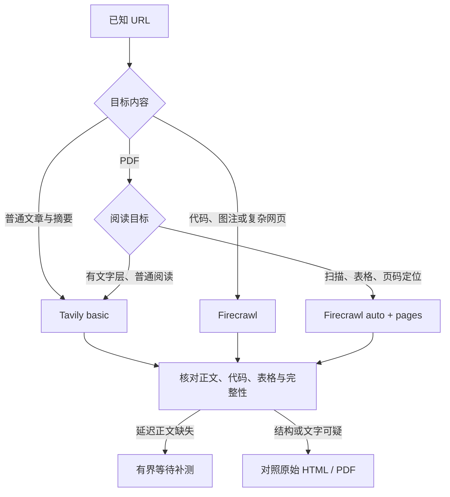

# Firecrawl 与 Tavily：网页和 PDF 抓取质量对比

> 核验日期：2026-09-26 UTC（本机日期 2026-09-25）。新增实测 15 个 URL、45 个基础组合、13 次原生补测、5 次 forager CLI 调用，共 **63 次抓取调用**；另做两次网络搜索。API 请求窗口约 04:51–05:02 UTC。环境为 macOS arm64、forager 0.5.3。研究对象是 Firecrawl Cloud Scrape v2 与 Tavily Extract，不是两家的搜索召回能力，也不是 Firecrawl 自托管版。
>
> 官方文档说明能力契约；社区记录说明其他用户遇到的现象；本地实测说明这一组 URL 在本次窗口的结果。三类证据不互相替代。本文不修改 forager 的代码、配置、provider 顺序或 ADR。

## 结论

**抓取质量优先时，Firecrawl 是更值得作为通用起点的候选；普通文章且预算优先时，Tavily basic 是合理的最小方案。PDF 必须区分文字层、扫描件和结构需求，不能统一宣称 Firecrawl 默认结果更好。**

| 场景 | 本轮判断 | 主要证据 |
| --- | --- | --- |
| 普通文章、说明性正文 | Tavily basic 通常够用；Firecrawl 不总是更干净 | Paul Graham 长文两家均命中 40/40 分布锚点；Firecrawl 把布局表格保留到 Markdown，输出更冗余 |
| API/编程文档 | 优先 Firecrawl，并检查正文边界 | Python 教程中 Firecrawl 保留 35 个代码块；Tavily 两档均无代码块，23 个较长代码块的 46 个首尾锚点全部缺失；MDN 则两家都好 |
| 动态和延迟网页 | Firecrawl 的可调控制更有价值，默认值仍会失败 | 普通 JS 页三档均取得 10 条名言；延迟 10 秒版本三档默认均未取得正文，Firecrawl 加 `waitFor:10000` 后取得 10/10 |
| 社区讨论、复杂 HTML | 分别检查重复、表格和图注 | HN 两家保留全部 71 条评论锚点，但 Tavily 重复明显；人口表三档均保留 238 组人口数值；论文 HTML 的图注 basic 6/15、advanced 和 Firecrawl 15/15 |
| 有文字层的 PDF，仅阅读 | Tavily 值得先试；不能保证公式或表格结构 | Bitcoin 和 Mixtral 两篇均取得长正文；Mixtral 中 Tavily 正确保留模型名称，Firecrawl 默认出现识别错误 |
| PDF 表格、页码和定位 | 优先实测过的 Firecrawl 分页/结构参数，再核对原件 | Mixtral 加 `pages:true` 后，Table 2 的 14 列、7 行共 98 个单元格与官方 HTML 基准一致；只刷新或只设 `mode:auto` 没有改善 |
| 扫描 PDF | Firecrawl 有明确优势，但仍要核验漏字、漏页脚 | 一页双栏扫描件中 Firecrawl 取得主要正文，Tavily basic/advanced 均失败；Firecrawl 仍漏掉页脚联系信息 |

这不是全网成功率排名。样本按问题类型选择，规模小、以英文为主；一篇扫描件不能估计所有扫描质量，两篇文本论文也不能代表财报、手写件或复杂公式全集。

## 官方能力与费用边界

| 维度 | Firecrawl | Tavily |
| --- | --- | --- |
| 基础抓取 | Markdown、HTML、raw HTML 等；可控制正文、标签、等待和浏览器动作 | Markdown/text；basic/advanced 两档，返回 `raw_content` |
| 动态页面 | 公开 `waitFor`、`actions` 等控制 | 官方将 advanced 用于更多表格、嵌入内容和 JS 页面，但 Extract 不公开对应的逐步浏览器动作控制 |
| 完整正文 | 正文边界受 `onlyMainContent` 等参数影响 | 本轮不传 `query`；传入后会按相关性选片段，`chunks_per_source` 每源 1–5 块、每块最多 500 字符，不应作为完整性对照 |
| PDF | `auto`、`fast`、`ocr`；可请求 `pages`、`blocks`、`pageMarkers`，用 `maxPages` 限制页数 | 已查 Extract 文档没有 PDF OCR、页级结构和页数上限的专项契约；这不等于不能读取 PDF |
| 缓存 | 默认缓存窗口两天，`maxAge:0` 强制刷新；缓存命中仍收费 | Extract 文档未公开对应的强制刷新参数 |
| 错误判定 | 除 API 成功外，要看 `metadata.statusCode` 和内容 | HTTP 200 仍可能只有 `failed_results`；需检查结果数组和正文 |

依据：[Firecrawl Scrape](https://docs.firecrawl.dev/features/scrape)、[Scrape API](https://docs.firecrawl.dev/api-reference/endpoint/scrape)、[PDF/Parse](https://docs.firecrawl.dev/features/parse)、[Tavily Extract API](https://docs.tavily.com/documentation/api-reference/endpoint/extract)、[Tavily 官方 Extract skill](https://github.com/tavily-ai/skills/blob/main/skills/tavily-extract/SKILL.md)。文档说明 `auto` 先尝试内嵌文字，必要时 OCR；本轮结果不证明其云端内部每次实际选用了哪条处理路径。

费用应比较成功取得目标内容的成本，而不是把两家的 credit 当成同一单位：

- Tavily Extract：每累计 5 个成功 URL，basic 1 credit，advanced 2 credits；按量价格为每 credit 0.008 美元。按此口径，普通成功 URL 约为 0.0016/0.0032 美元，未计套餐差异。单次 `usage` 可能为 0，不能当作该调用免费。[官方费用](https://docs.tavily.com/documentation/api-credits)
- Firecrawl 基础 Scrape 1 credit；现行增强代理升级附加 **0**。旧资料中的“增强代理 5 credits”不适用于当前文档。[Billing](https://docs.firecrawl.dev/billing)、[Enhanced Mode](https://docs.firecrawl.dev/features/enhanced-mode)
- **Firecrawl PDF 的文档措辞与本轮响应计数不完全一致。**Billing 将 PDF 写为基础费之外每页 +1；Parse 页写每页 1。本轮 `/scrape` 的 `creditsUsed` 对 1、9、13 页分别返回 1、9、13，限制 4 页返回 4。本报告保留这一差异，不把“页数 +1”当成本轮实付金额，也没有核对账户发票。
- 58 次原生调用中，响应报告的 credit 合计为 Firecrawl 132、Tavily 9；另有一次 Firecrawl fast 扫描件失败和一次 Tavily 网络失败没有 credit 字段，5 次 CLI 调用未暴露原生用量。该合计不是本次账单。失败响应中出现 Tavily `usage:1`，结合官方累计计数说明，不能据此认定该失败本身被收费。

## 方法与质量口径

基础矩阵为 **15 URL × Tavily basic / advanced / Firecrawl 默认形态**。按 URL 轮换三档执行顺序；没有自动重试、换 key 或跨 provider fallback。Tavily 显式设 `timeout:60`、`include_usage:true`，不传 query；Firecrawl 请求 Markdown、`onlyMainContent:true`、`timeout:60000`，基础阶段不额外设 parser、等待或缓存参数。客户端上限为 150 秒。

这与当前 forager 的内容选项接近，但 Tavily 原生测试的 60 秒超时高于 API 默认值，故不是逐字节相同的 CLI 请求。另用 CLI 定向复核 Python 和延迟页面，每次仅提供一个 provider 和一个凭据，禁用自动重试。凭据只在进程内读取，未写入结果。

主要质量口径：

1. **内容完整度**：正文段落首尾、代码块、方法名、图注、评论、表格数值分开核对。HTTP 200、非空内容和 token 数都不代表完整。
2. **结构正确性**：表格须检查行列及单元格；PDF 公式须对照原页。仅出现全部数字不能证明列关系正确。
3. **冗余**：比较原页与输出的评论锚点出现次数，辅以 token 数；不把所有重复都自动删除。
4. **原件核验**：直接保存 HTML/PDF、SHA-256、PDF 页数和每页文字量；用浏览器确认 JS 内容及维基页面，用 PDF 渲染图核对扫描件、公式和表格。

Markdown 比较会去除链接目标、`<br>`、标点和空白，不评估语义等价。中文维基源页与 provider 存在简繁转换差异，其严格字符串匹配不适合用来排名，因此不把该项匹配率当作完整率。PDF 文字行匹配会受公式表示和断词影响，只作为检查线索。

直接 HTTP 读取两页维基时返回 403，随后浏览器取得正文；SSRN 直接 HTTP 也返回 403，但两家 API 都取得页面信息。这些是不同访问路径的观测，不能认定某一个 provider 具有普遍的反爬成功率。

## 15 个基础样本的结果

表中“成功”仅针对所列目标，不代表页面所有信息都无损。完整 URL 与请求在 [cases.json](firecrawl-tavily-2026-09-26/cases.json) 和 [results.json](firecrawl-tavily-2026-09-26/results.json)。

| 样本 | Tavily basic | Tavily advanced | Firecrawl 默认 |
| --- | --- | --- | --- |
| [MDN Using Fetch](https://developer.mozilla.org/en-US/docs/Web/API/Fetch_API/Using_Fetch) | 首次 TLS 失败；一次补测与 advanced 相同 | 正文锚点 90/90、代码锚点 46/46 | 同样 90/90、46/46 |
| [Python Data Structures](https://docs.python.org/3/tutorial/datastructures.html) | 正文大体保留，代码和方法定义严重缺失 | 与 basic 字节相同 | 保留 35 个代码块和 11 个方法名；有导航噪声，部分脚注缺失 |
| [How to Do Great Work](https://paulgraham.com/greatwork.html) | 40/40 分布锚点，较干净 | 与 basic 相同 | 40/40；HTML 布局表格与 `<br>` 进入 Markdown |
| [中文维基：大语言模型](https://zh.wikipedia.org/wiki/大语言模型) | 正文较紧凑，有简繁差异 | 增加大量语言/导航链接；不能按长度判更完整 | 长正文及结构；有旗标、图像/链接等额外 token |
| [中文 MDN JavaScript 简介](https://developer.mozilla.org/zh-CN/docs/Web/JavaScript/Guide/Introduction) | 正文锚点 28/28 | 与 basic 相同 | 正文锚点 28/28 |
| [即时 JS 名言页](https://quotes.toscrape.com/js/) | 10/10 名言与作者 | 与 basic 相同 | 10/10 |
| [延迟 10 秒名言页](https://quotes.toscrape.com/js-delayed/) | failed_results，无正文 | failed_results，无正文 | API 成功，但仅标题/登录链接，0/10 名言 |
| [HN Dropbox 讨论](https://news.ycombinator.com/item?id=8863) | 71/71 评论锚点，明显重复 | 与 basic 相同 | 71/71，重复显著较少 |
| [SSRN Dual Momentum 页面](https://papers.ssrn.com/sol3/papers.cfm?abstract_id=2042750) | 标题、作者、摘要等页面信息 | 与 basic 相同 | 同样取得页面信息；不是下载到论文全文 |
| [Mixtral HTML v1](https://arxiv.org/html/2401.04088v1) | 13/13 标题、6/15 图注、35/35 文献锚点 | 图注补到 15/15，文献 35/35 | 图注 15/15、文献 35/35；正文锚点 68/68，高于 Tavily 两档 63/68 |
| [维基人口表](https://en.wikipedia.org/wiki/List_of_countries_by_population_(United_Nations)) | 238/238 组两个年份的人口数值，有表格结构 | 与 basic 相同 | 同样 238/238；多保留国旗图像链接 |
| [W3C Dummy PDF](https://www.w3.org/WAI/ER/tests/xhtml/testfiles/resources/pdf/dummy.pdf)，1 页 | 失败 | 失败 | 正确得到三个词的全部内容；这是极短控制样本 |
| [Bitcoin PDF](https://bitcoin.org/bitcoin.pdf)，9 页 | 抽查文字 30/30；公式有私用字符及线性化 | 与 basic 相同 | 抽查文字 30/30；代码格式较好，但部分 LaTeX 转义/公式仍有问题 |
| [Mixtral PDF v1](https://arxiv.org/pdf/2401.04088v1)，13 页 | 文字及模型名称较准确；表格被压平成行文本 | 与 basic 相同 | 名称/表头错误，如 Mixtral 被写成 Mistral；默认没有可用 Markdown 表格 |
| [OCRmyPDF ccitt 扫描件](https://raw.githubusercontent.com/ocrmypdf/OCRmyPDF/main/tests/resources/ccitt.pdf)，1 页 | 失败 | 失败 | 双栏主要正文可读、顺序合理；页脚公司地址/电话缺失 |

11 个基础样本在 basic、advanced 两档都取得非空内容，其中 **9 个输出字节完全相同**。MDN basic 补测也与 advanced 相同。差异明显的是中文维基与 Mixtral HTML；advanced 在这两页变长，不代表其新增内容都有价值。无证据支持所有请求一律升级 advanced。

### 文档代码与社区重复

Python 原页有 35 个 `<pre>`。Firecrawl 有对应的 35 个 fenced code block；Tavily 两档均无 fenced block，较长的 23 个代码块共 46 个首尾锚点为 0/46，Firecrawl 为 46/46。Tavily advanced 改为 `format:text` 后仍为 0/46；forager basic CLI 补测复现相同正文。因此不能把问题归因于本地 Markdown 渲染或 forager 的归一化。

HN 71 条评论的首部锚点，在原始评论正文中合计出现 72 次，在 Firecrawl 中为 72，在 Tavily 两档均为 219。一个锚点在原页本来就重复，故没有把“出现两次”直接视为错误。Tavily 输出 41,747 token，Firecrawl 为 15,852，约 **2.63 倍**；这里更长主要意味着额外重复和包装，并未带来更多评论覆盖。

### 动态等待与缓存的影响

延迟名言页的源码明确设置 10,000 毫秒，浏览器渲染后显示 10 条。Firecrawl 默认首次返回 94 字符的标题和登录链接；API 和目标状态都是 200。补测 `waitFor:10000,maxAge:0` 后返回 10/10 条，耗时 12.34 秒。

后续 forager Firecrawl 默认 CLI 也返回了完整名言，与补测正文相同。该请求发生在等待补测之后，**不能把它作为默认设置能等待十秒的独立证据**；缓存或服务状态已受前次抓取影响。Tavily CLI 仍因零正文被质量门拒绝。

### PDF 参数会改变可用质量

Mixtral PDF 的源文件为 13 页，SHA-256 为 `f8bbf0e9d979b7a8ce7be65119266545a229a85b57e077d8bd048e458bb642da`。以下都是同一固定版本 URL。

| Firecrawl 形态 | 耗时 | Markdown token | Table 2 行列核对 |
| --- | ---: | ---: | --- |
| 默认 | 2.46 秒 | 7,844 | 无表格结构；有模型名/表头错误 |
| 仅 `maxAge:0` | 2.35 秒 | 7,844 | 与默认正文完全相同 |
| `mode:auto,maxAge:0` | 2.31 秒 | 7,844 | 与默认正文完全相同 |
| auto + `pages:true`，刷新 | 52.55 秒 | 17,397 | 7 行 × 14 列，98/98 单元格匹配 |
| auto + `blocks:true`，刷新 | 11.57 秒 | 16,513 | 98/98 |
| auto + `pageMarkers:true`，刷新 | 11.39 秒 | 16,476 | 98/98 |
| auto + pages/blocks/pageMarkers，刷新 | 52.23 秒 | 17,461 | 98/98，返回 13 页及 blocks |
| fast + pages/blocks/pageMarkers，刷新 | 12.69 秒 | 17,318 | 98/98，返回 13 页及 blocks |
| ocr + 三个结构选项 + `maxPages:4`，刷新 | 15.98 秒 | 5,064 | 前四页内 Table 2 为 98/98；明确只读 4/13 页 |

单元格基准来自同版本官方 HTML，另以 PDF 第 4 页渲染图核对表头与数值。98 包含一行表头和六行数据。零个结构单元格表示未形成待验证表格，不表示数值全部丢失。完整检查记录在 [table2-checks.json](firecrawl-tavily-2026-09-26/table2-checks.json)。

**可确认的是输出差异，不能据此断言内部解析器的实现。**三种结构选项各自都改善了本样本，单纯刷新和显式 auto 均未改善；差异不应只解释为顶层旧缓存。这仍是单论文定向实验，部分运行可能复用了不可观测的内部中间结果，不能用这些耗时推导稳定性能排名。更好的 Markdown 约为默认的两倍 token，也不意味着全篇每个图中数字或公式都已验证。

扫描件原始 PDF 没有可提取文字，确认需要 OCR。默认 auto 与显式 ocr 返回相同主要正文；即使同时设置 `onlyMainContent:false`，页脚仍缺失。`fast` 明确返回 500，提示扫描件需要 auto/ocr。因为 ocr 补测同时请求了分页/blocks，不能把这些选项各自对扫描质量的影响分离。

## 网络调研与社区记录

采用官方文档、GitHub issue 正文/评论以及作者原帖。发现阶段用 forager 普通搜索；搜索摘要只用来找链接。没有找到公开完整 URL 集、参数、原始输出、评分规则且同时覆盖两家 PDF/JS 的独立可复现实验。

| 来源 | 具体报告 | 证据边界 |
| --- | --- | --- |
| [Firecrawl #3968](https://github.com/firecrawl/firecrawl/issues/3968)，2026-07-08 | 云端不同 PDF URL 返回了同一份旧文档内容；报告者用 `max_age=0,store_in_cache=false` 后得到正确文档 | 有请求、日期和哈希线索，但无维护者确认根因；本轮未复现“跨 URL 串文” |
| [Firecrawl #4712](https://github.com/firecrawl/firecrawl/issues/4712)，2026-09-21 | 相同 PDF 字节、强制刷新，十二天内文本行数 169–174 | 作者称主要为换行差异，不能当作事实缺失；无回应 |
| [Firecrawl #495](https://github.com/firecrawl/firecrawl/issues/495)，2024-08-03 | Cloud Playground/自托管的 Cloudflare 阻挡报告 | 协作者对一站无法复现，对另一站指出 CAPTCHA；说明控制能力不等于任意站点保证 |
| [Tavily #69](https://github.com/tavily-ai/tavily-python/issues/69)，2025-01-29 | 默认 Extract 没有取得若干新闻站的预期正文 | 贡献者建议 advanced，但线程没有用户复测成功证据 |
| [Tavily #77](https://github.com/tavily-ai/tavily-python/issues/77)，2025-02-20 | Search 的 PDF 内容不可读；贡献者建议对 URL 使用 advanced Extract | 属于 Search 问题，不能计作 Extract 的失败样本，也不能推导 OCR 保证 |
| [Firecrawl #2214](https://github.com/firecrawl/firecrawl/issues/2214)，2025-09-26 | 自托管 PDF OCR 功能请求，以 not planned 关闭 | 不能把 Cloud PDF 契约自动归给默认自托管部署；参见[部署差异](https://docs.firecrawl.dev/contributing/open-source-or-cloud) |

Reddit 有[同批 100 URL 对比自述](https://www.reddit.com/r/WebScrapingInsider/comments/1vl2nh7/whats_the_best_web_extraction_tool_in_2026_i/)，作者报 Firecrawl 93/100、Tavily 87/100“可用”。原帖未提供 URL 清单、参数、逐项评分和输出，也没有 PDF 分项；作者独立性不可核验。这只能作为未复现的社区自述，不能替代本轮或总体成功率。另一个[100 查询的 agent 工作流帖](https://www.reddit.com/r/vectordatabase/comments/1v7gdrk/benchmark_exa_vs_tavily_vs_firecrawl_for_llm/)讨论的是查询和工作流，不是同 URL 抓取；[HN 开发者自述](https://news.ycombinator.com/item?id=46177952)也只说明使用分工，没有提供对照数据。

这些反馈共同支持“按页面类型、内容质量和缓存状态诊断”的做法，但不足以统计哪个服务更稳定。

## 对 forager 的建议

下面是提案，不是已实现行为。当前 ADR 0009 规定全局 `Tavily → Firecrawl → Jina`，Firecrawl 不做额外等待或第二次探测；更改默认次序或职责边界需要同步处理该约束。



- **最小可行方案**：保留现有链；在需要代码、图注或表格的任务中显式选择 Firecrawl/结构档。Tavily basic 适合成本敏感的普通正文读取。不能只等“空或过薄”才判定不合格，Python 示例说明长正文也能缺核心内容。
- **质量优先方案**：将“完整网页”和“普通阅读”作为明确的使用需求，前者优先评估 Firecrawl。PDF 请求显式保留页级信息；扫描件 auto/ocr，已有文字层且只读 prose 时可先 Tavily。不要将本轮结果压成一个不分内容角色的全局成功率。
- **暂不推荐**：所有 Tavily 请求都 advanced；所有 Firecrawl 都固定等待十秒；只根据 token 长短判质量；将 SSRN 摘要页当论文全文；将带 LaTeX 外观的字符串直接视为正确公式。

本轮实测可用的 PDF 分页请求：

```json
{
  "url": "https://arxiv.org/pdf/2401.04088v1",
  "formats": ["markdown"],
  "onlyMainContent": true,
  "timeout": 60000,
  "parsers": [{"type": "pdf", "mode": "auto", "pages": true}],
  "maxAge": 0
}
```

`maxAge:0` 是本次控制变量，不建议仅凭这轮实验永久禁用生产缓存。`pages:true` 有页级定位的明确价值，但其对本篇正文质量的改善是观测结果，不是官方对所有 PDF 的保证。

## 与既有 arXiv 实测的关系

仓库另有[九篇 arXiv 全文实测](2026-09-26-arxiv-full-text-fetch-benchmark.md)，可补充长论文和不同年代的覆盖；其调用不计入本轮 63 次。两轮均观察到图注/公式/正文边界差异，但不能合并为同一独立样本集。

特别是同一 `2401.04088v1` HTML：旧记录 Tavily 为 25,726 字符，本轮 basic 为 31,654；本轮保留 35/35 文献锚点，不能继续沿用旧轮“basic 缺参考文献”的绝对表述。服务输出在同一天也可能变化。本文优先报告本轮冻结响应，不覆盖旧记录，也不据此推断厂商已修复所有类似问题。

## 制品、复现与局限

- [原始制品目录](/Users/jfmoe/.local/share/forager/research/firecrawl-tavily-20260926)：约 13.3 MB，含原始 API 响应、解码 Markdown、HTML/PDF 原件、浏览器基准、渲染图、逐次账本和 SHA-256 清单。没有凭据；原件未加入 Git。
- [汇总数据](firecrawl-tavily-2026-09-26/results.json)、[样本](firecrawl-tavily-2026-09-26/cases.json)、[核对锚点](firecrawl-tavily-2026-09-26/probes.json)、[表格核对](firecrawl-tavily-2026-09-26/table2-checks.json)。
- [抓取脚本](firecrawl-tavily-2026-09-26/bench.py)、[质量核对脚本](firecrawl-tavily-2026-09-26/assess.py)、[表格核对脚本](firecrawl-tavily-2026-09-26/check_table.py)、[CLI 复核脚本](firecrawl-tavily-2026-09-26/cli_checks.py)、[依赖版本](firecrawl-tavily-2026-09-26/requirements.txt)。

重跑会消费账户额度。脚本读取本机 `~/.config/forager/config.toml` 中两家首个 key，直连官方 Cloud API；不会更改配置。用独立输出目录，避免覆盖冻结结果：

```bash
bench_dir=$(mktemp -d)
uv venv "$bench_dir/venv"
uv pip install --python "$bench_dir/venv/bin/python" \
  -r docs/research/firecrawl-tavily-2026-09-26/requirements.txt
FETCH_BENCH_DIR="$bench_dir" "$bench_dir/venv/bin/python" \
  docs/research/firecrawl-tavily-2026-09-26/bench.py direct
FETCH_BENCH_DIR="$bench_dir" "$bench_dir/venv/bin/python" \
  docs/research/firecrawl-tavily-2026-09-26/bench.py base
```

`assess.py` 需要浏览器保存的两页维基 HTML 与名言 JSON 基准。复核本轮数字可直接指向已归档目录；评估新的实时响应时，应重新取得基准，不能把当前网页与旧缓存差异全部视为漏文。补测请求的完整 JSON 在 results 中；`bench.py one --id ... --mode ... --suffix ... --changes 'JSON'` 可按指定配置复现。

本轮有两次客户端 TLS/网络失败，均单独记录、各补测一次，不归咎于目标网页。运行中服务重启中断了执行器；根据已完成的逐条响应续跑，没有重复已完成的基础项。原进程退出状态不可恢复，续跑及各补测进程均取得最终退出结果。

基础 Firecrawl 多数命中缓存，Tavily 不暴露可比缓存状态。三档基础请求的墙钟中位数约为 2.52、2.55、1.98 秒，**不构成冷启动性能排名**。没有多时段重复、随机全网样本、认证登录、付费墙访问、手写 OCR、中文扫描 PDF、网页多轮交互或自托管对照；特殊页中的 SSRN 也只验证页面信息。全文结构正确率与生产可用率仍需按实际目标站点扩展样本。
