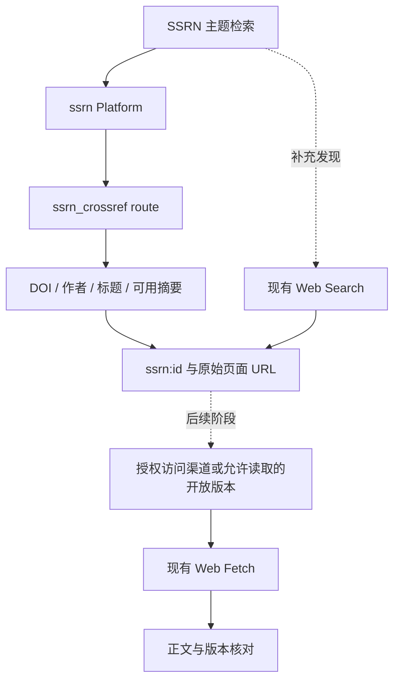
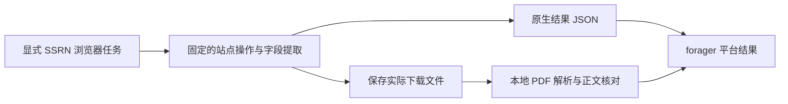

# SSRN 检索接入方案

核验日期：2026-09-26。代码基线：`8a72d6e`；本机 CLI：`forager 0.6.0`。本文是接入提案，尚未实现 SSRN Platform。

## 建议

**新增 `ssrn` Platform，以匿名 Crossref REST API 作为首条 `ssrn_crossref` route；先交付结构化检索与元数据读取。** SSRN 链接发现使用现有 Web Search 补充；全文作为后续独立阶段，先确认来源许可与自动访问授权，再验收下载地址、正文和版本。

**本机浏览器路线已验证可行：OpenCLI 1.8.6 连接现有 Chrome，跑通了原生搜索、翻页、详情及一篇 PDF 下载。** 如果目标优先考虑原站字段和论文下载，当前本机应优先评估基于 OpenCLI 的可选 `ssrn_browser` route；Crossref 保留为无需浏览器的元数据路线。agent-browser 的独立 Chrome 会话被站点拒绝，现有 Chrome 的 CDP 自动连接也不可用，不能根据此结果推断所有浏览器自动化都不适合 SSRN。两条路线的适用环境不同，详见下文现场实测。

该方案适合“按主题找 SSRN 论文、取得稳定身份、作者与可用摘要”。它不承诺 SSRN 全库覆盖、站内排序、下载排行、实时提交日期或全文检索。Crossref 是 SSRN 已登记 DOI 的元数据入口，不能视为 SSRN 原生搜索镜像。



Web Search 补充由调用方显式选择；它不是首条 route 成功后仍会自动运行的并行合并。当前平台链接受第一条成功结果，不是多源召回引擎。

## 数据源选择

| 路线 | 优势 | 代价与边界 | 建议 |
| --- | --- | --- | --- |
| Crossref REST | 匿名 JSON、DOI 精确读取、查询与分页；可复用现有 HTTP 和平台链 | 摘要与日期不完整；登记和更新不等于站内发表或修订；无全库覆盖证明 | 首条 route |
| SSRN 站内页面解析 | 接近原站字段，可见下载数、JEL、修订时间与下载链接 | 官方条款限制自动查询；本机直接访问出现 403；页面与下载流程会变化 | 没有适用授权时不接入 |
| 现有 Web Search | 无需新 provider 即可发现 SSRN 页面与部分 PDF | 排序、覆盖、摘要和分页由供应方决定；不是平台原生记录 | 补充召回；先沿用现有入口 |
| OpenAlex | 跨库发现、作品关系与开放版本定位 | SSRN 版本可能附着于合并作品；需核查 SSRN location，不能只看主 DOI；增加服务依赖与额度管理 | 有跨库需求后再评估 |
| Semantic Scholar | DOI 查询、引文图与开放 PDF 信息 | 覆盖、合并和可用字段需逐项核查；引文数量不等于 SSRN 站内指标 | 引文功能的候选，不阻塞首期 |
| 第三方 SSRN scraper/MCP | 可复用封装 | 网页访问限制与解析维护成本仍存在；额外运行时不能消除上游问题 | 不引入主执行路径 |

OpenAlex 将预印本、接受稿、出版版作为同一 work 的不同 location；接入 SSRN 时应检查 `locations` 中的 SSRN 副本，而非只用 `primary_location` 或 work 的规范 DOI。Semantic Scholar 提供 DOI 查找、引文关系等能力，但不能据此推导 SSRN 全库覆盖。[OpenAlex 位置模型](https://help.openalex.org/data/locations/)、[Semantic Scholar API](https://api.semanticscholar.org/api-docs/)。

### 官方入口与使用边界

在本次核查的 SSRN 官方资料与 [Elsevier API 产品目录](https://www.elsevier.support/dataasaservice/answer/overview-of-elsevier-apis)中，未找到公开文档化的 SSRN 检索 API。Scopus、ScienceDirect 的接口和 key 不能当成 SSRN 接口；“未找到公开文档”也不等于不存在内部或合作伙伴服务。

SSRN 于 2026-04-13 宣布商业产品（包括 Data Feeds）将在 **2026 年 12 月底前关闭**，不再接纳新客户；存量合同执行到到期日与 2026-12-31 中较早者。公告提到未来改善 Crossref 元数据，但这不是已经完成的质量承诺。因此不以旧商业 Data Feeds 作为新集成基础。[官方战略公告](https://blog.ssrn.com/2026/04/13/ssrn-strategic-update-renewed-focus-on-core-research-sharing-mission/)。

当前可读的 SSRN Terms 在 User Representations and Warranties 中明确写有 **“automated queries of any sort”** 的禁令；Extent of Terms 另说明适用的专项服务或许可条款可优先。工程结论是：没有明确适用授权时，不把直接网页抓取、浏览器自动化或第三方代理包装成 SSRN 默认 route。抓取工具返回成功不能证明已获授权。页面标注 Last updated June 2017，本文仅记录 2026-09-26 读取的当前文本。[SSRN Terms of Use](https://www.ssrn.com/index.cfm/en/terms-of-use/)。

Crossref 对书目事实与自生成数据提供宽松复用，但 **摘要仍保留作者或出版方的版权**，不能把整个 API 响应笼统标成 CC0；读取接口、再分发摘要和批量训练是不同的使用范围。[Crossref 元数据许可](https://www.crossref.org/documentation/retrieve-metadata/)。

SSRN 官方说明：完成审核且含全文 PDF 的合格预印本才分配 DOI，通常需要数个工作日；修订保持原 DOI。由此可知，基于 Crossref 的路线天然不能保证发现尚未取得 DOI 的新条目，DOI 也不能锁定某次修订。这些限制来自上游流程，不是多重重试能解决的问题。[SSRN DOI 说明](https://www.elsevier.support/ssrn/answer/doi)。

## Crossref 与 Web Fetch 基线实测

使用 Crossref 公共 REST 接口串行请求；没有提供 key、邮箱或改动账户配置。主题样本按检索结果前 20 条统计，随机样本使用 API 的 `sample=100`。这些样本不构成全库覆盖率或总体检索质量评估。[请求、字段投影与原始响应哈希](ssrn-2026-09-26/evidence.json)保留了本轮证据。

| 请求 | 返回记录 | 有摘要 | 有 `link` 字段 | 主要观察 |
| --- | ---: | ---: | ---: | --- |
| `query.bibliographic=dual momentum` | 20 | 16 | 0 | 第一条为 `10.2139/ssrn.2042750` |
| `query=machine learning asset pricing` | 20 | 15 | 0 | 包含一条 `journal-article` 类型 |
| `query=carbon emissions regulation` | 20 | 13 | 0 | 包含一条 `journal-article` 类型 |
| 前缀内 `sample=100` | 100 | 47 | 0 | 16 条为 `journal-article`；全部发布日期只有年份 |
| DOI 精确读取 `10.2139/ssrn.2042750` | 1 | 1 | 0 | 标题、作者、摘要与 SSRN 原始地址可读 |

这些结果的 DOI 全部符合 `10.2139/ssrn.<数字>`。随机请求响应的 `total-results` 为 1,487,173，这是当时该前缀的 Crossref 记录数，不是 SSRN 全库论文数。[前缀接口](https://api.crossref.org/prefixes/10.2139/works?sample=100)、[单篇记录](https://api.crossref.org/works/10.2139/ssrn.2042750)。

### 四个会影响实现的事实

1. **不能按 `type:posted-content` 限定 SSRN 身份。** 本轮多个 SSRN DOI 被登记为 `journal-article`；该过滤会漏掉记录。用前缀缩小查询范围，再验证完整 DOI 形状及 SSRN 身份。保留上游类型作为元数据。
2. **缺摘要是正常数据状态。** 随机样本 53/100 没有摘要；不能据此抛弃整页、伪造摘要，或把纯标题记录标成 `abstract`。Crossref 摘要还可能含 JATS/XML 标记，需保留段落、解码实体并去除包装。
3. **年月日精度与时间语义必须保留。** 对 2026-09-01 至 2026-09-26，`from-pub-date`/`until-pub-date` 只返回 1 条，而 `from-created-date`/`until-created-date` 返回 22,958 条。最近登记的五条 `published` 也只有 `[2026]`。不能把年份补成 1 月 1 日，不能把 Crossref `created` 或 `indexed` 冒充 SSRN 提交、修订日期。[发表日期查询](https://api.crossref.org/prefixes/10.2139/works?rows=20&sort=published&order=desc&filter=from-pub-date%3A2026-09-01%2Cuntil-pub-date%3A2026-09-26)、[登记日期查询](https://api.crossref.org/prefixes/10.2139/works?rows=5&sort=created&order=desc&filter=from-created-date%3A2026-09-01%2Cuntil-created-date%3A2026-09-26)。
4. **分页必须显式保留排序，且不是快照。** 本轮带 `cursor=*` 而没有 `sort` 的请求返回旧记录在前；加 `sort=score&order=desc` 后，相关论文回到首位。用上游 cursor 继续下一页成功，但两页共 40 条出现 1 个重复 DOI。不要承诺跨页无重复或冻结排名；批量消费方按 ref 去重。本轮没有定位重复的具体上游原因。

Crossref 官方将 `created`、`updated`、`indexed` 区分为新登记、成员更新、包含第三方变化的索引更新，并提醒分页期间记录可能重建索引。游标是续页位置，不是数据库快照。[Crossref 使用建议](https://www.crossref.org/documentation/retrieve-metadata/rest-api/tips-for-using-the-crossref-rest-api/)。

### 网页与搜索补充

对同一[SSRN 摘要页](https://papers.ssrn.com/sol3/papers.cfm?abstract_id=2042750)，本机普通 HTTP 返回 403；`forager fetch` 经 Firecrawl 返回标题、作者、摘要、Posted/Last revised 信息和真实下载链接。页面明确包含版权许可说明。这是技术可达性观测，不是授权依据。此基线阶段未请求 PDF；后续浏览器下载的独立结果见下文。

该页下载链接的路径是 `SSRN_ID2881657_code1556771.pdf`，query 中的 `abstractid` 却是 `2042750`。因此 **不能从 abstract ID 拼接 PDF 文件名**，也不能把文件名中的数字当论文身份。只消费上游实际返回、经身份核对的链接。

普通 `forager search` 对 dual momentum 返回 12 个主来源 URL，以及 Tavily 提供的 2 个补充候选，且没有 capability gap。除上述摘要页外，本轮没有逐篇读取这些结果；该实验只证明现有入口能发现候选，不证明全部标题、作者和论述正确。

## 接入契约建议

### 平台与身份

- 平台：`ssrn`；首条 route：`ssrn_crossref`；默认 order 只有这一条。使用现有 PlatformSearch/PlatformFetch、匿名执行器、Attempt Trace 和配置注册流程。
- ref：`ssrn:2042750`；canonical URL：`https://papers.ssrn.com/sol3/papers.cfm?abstract_id=2042750`。
- 本地解析可支持 ref、规范摘要页、`https://ssrn.com/abstract=2042750` 及明确的 `10.2139/ssrn.2042750` DOI 形式。它们的 ID 可直接解析，不需要追踪重定向；任意不透明短链仍拒绝。限定已核验的主机、路径和数字 ID，不接受相似域名。
- DOI 读取命中后，必须核对返回 DOI 与请求身份一致。Crossref 404 只能说明该 DOI 未在 Crossref 找到，不能报告“SSRN 论文不存在”。
- 不给 SSRN ref 添加臆造的 `v1`。保存提供方、来源 URL、抓取时间和上游登记/更新时间，不能由这些字段推出论文版本。

### search

最小请求形状：

```http
GET https://api.crossref.org/prefixes/10.2139/works
    ?query=machine%20learning%20asset%20pricing
    &rows=20
    &sort=score
    &order=desc
    &cursor=*
```

首期公开查询词、`--limit` 和 `--cursor` 即可。普通查询是上游相关性检索，不承诺所有词严格匹配，也不是论文全文检索。标题/作者选项若后续加入，要说明它们是 Crossref 字段查询，不能照搬 arXiv 的严格组合语义。

forager 的不透明 cursor 包装原查询、limit、选项和上游 `next-cursor`；后续请求仍绑定 `ssrn_crossref`，并显式携带相同排序。终页同时参考上游 cursor 和原始页数量；不能因过滤了无效记录而错误认定已经到尾页。合法空页与 HTTP/解码错误继续区分。

如以后增加时间选项，优先暴露明确的“Crossref 登记时间”或发表年份筛选；不提供没有可信字段支撑的 `--submitted-from`、`--updated`、下载排行或引用排行。

### fetch 与内容深度

```http
GET https://api.crossref.org/works/10.2139/ssrn.2042750
```

**建议给 Content Depth 增加 `metadata`，并先更新平台规格。** 现有四个值 `snippet`、`abstract`、`full_text`、`thread` 没有明确表达“只有书目信息”；缺摘要样本已证明这不是推测性需求。

- search：有完整上游摘要的条目标记 `abstract`；其他条目标记 `metadata`，`abstract: null`。
- fetch：SSRN 默认 `--depth metadata`，返回书目信息；显式 `--depth abstract` 才要求摘要。摘要缺失时返回清楚的内容不足错误，不静默降级。增加更丰富的 route 后，可在同一平台链内尝试补齐。
- 第一版的 `full_text` 为不支持深度，按现有规则飞行前退 2。不要让 route 声明支持后返回空 `content_urls`，当前编排会将此当作 Runtime 错误。
- 保留 `doi`、可用摘要、Crossref 类型、原始日期精度、元数据时间与来源。没有数据的站内下载量、JEL、修订时间不从其他字段推断。

这些命令是拟议接口，目前不可执行：

```console
forager platform ssrn search 'machine learning asset pricing' --limit 20
forager platform ssrn fetch ssrn:2042750
forager platform ssrn fetch ssrn:2042750 --depth abstract
```

### 访问策略

本轮公共 API 响应声明 `x-rate-limit-limit: 5`、`x-rate-limit-interval: 1s`、`x-concurrency-limit: 1`。这是当时响应，不是永久配额。首期采用保守的每秒最多一次、并发 1，复用现有跨进程 Access Policy；继续遵守上游 429 和命令 Deadline，不新增重试循环。该限速只协调共享本地状态的 forager 进程，不能替所有共用出口的客户端兜底。

route 声明无需凭据，不增加 `keys`，默认使用公共池。若以后支持 Crossref polite pool，联系人必须由用户明确配置，不能硬编码个人邮箱，也不能把邮箱当成 API key。

## 全文阶段为什么应单独验收

当前 `platform_fetch` 先取平台元数据，再把 route 声明的 `content_urls` 交给全局 Web Fetch；route adapter 不能横向 import Web Fetch provider。这个边界应保留。[平台规格](../spec/forager/07-platforms.md)、[平台正文编排](../../src/core/platform_fetch.rs)。

SSRN 与 arXiv 的差别是：Crossref 样本没有提供 PDF `link`，下载地址通常需要读取落地页才知道；而 SSRN 落地页本身足够长，能通过现有薄正文门。把它直接放进 `content_urls`，会把摘要、指标和推荐列表误标为论文 `full_text`。[当前质量门](../../src/core/engine.rs)、[已有 SSRN 页面实测](2026-09-26-firecrawl-tavily-fetch-quality.md)。

后续若确需全文，先确认有适用授权的 SSRN 访问渠道，或选择允许读取的作者/机构公开版本。授权允许读取 SSRN 落地页时，再在编排层明确增加“解析候选下载地址”的阶段；也可使用提供经核验 PDF 地址的数据源。保持实际正文来源 URL，核对题名/作者/论文身份与版本，不自动用某篇期刊正式版替代 SSRN 版本。OpenAlex 等返回的作者版本可作为显式替代候选，不是同一平台身份的无条件成功结果。

最低验收样本应包含：有/无 PDF、仅摘要、访问拒绝、登录页、已撤稿或替换版本、下载链接失效、同题不同版本。仅有 HTTP 200、较长 Markdown 或 `.pdf` 字符串都不足以证明全文取得。

## 浏览器自动化路线

Crossref 的推荐针对默认、无人值守的元数据查询。如果目标是原生 SSRN 结果、站内排序、精确 Posted/Last revised 字段或下载流程，**浏览器路线值得独立验证**；Crossref 不能完整替代这些需求。本节比较技术适配性，SSRN 访问仍受前述适用条款约束。

浏览器可以执行页面 JavaScript、提交表单、读取渲染后的 DOM、保存会话，并处理用户已有登录态下的操作。这能解决一部分普通 HTTP 缺少渲染和会话的问题；不保证消除访问拒绝、验证页面、账户限制或页面结构变化。

### agent-browser、OpenCLI 与 Playwright 的取舍

- **agent-browser：适合先验证流程。** 本机版本为 `0.38.1`；当前实现使用 Rust CLI/daemon 直接控制 CDP，不依赖 Playwright。它提供 snapshot/ref、语义定位、JSON 输出、独立 session、profile 和状态恢复，既可以供 agent 交互操作，也可以编成固定脚本。对一次性的站内探索，现成命令能降低起步成本；正式 route 仍需自行定义字段提取、终态判定和分页契约。[官方说明](https://agent-browser.dev/)。
- **Playwright Library：适合自行维护固定流程。** 可在一个受控的 TypeScript helper 内管理 context、locator、网络响应、下载事件与清理，再向 Rust 返回结构化结果；不需要模型在每一步决定点击目标。代价是引入 Node/浏览器运行环境与站点脚本维护。Library 与 Playwright Test 是不同入口，生产执行应使用 Library，Test 用于验收。[Library](https://playwright.dev/docs/library)。
- 两者都能维护状态。Playwright 可以保存认证状态、启动独立持久 profile，或通过 CDP 连接已有 Chromium；官方提示 CDP 连接的功能保真度低于 Playwright 原生连接。应明确选择“复用用户浏览器”还是“自管独立浏览器”，不要假定它们行为完全相同。[认证状态](https://playwright.dev/docs/auth)、[BrowserType](https://playwright.dev/docs/api/class-browsertype)。

**OpenCLI：适合将已验证的站点流程封装成可重复命令。** 本机版本 `1.8.6` 的命令目录未见 SSRN；官方源码 `1.8.8`、提交 `24136945847afbfad266c6c46a8cd335377f9112` 也没有 SSRN adapter。已有 Google Scholar DOM 搜索适配器可作结构参考，但不证明 SSRN 可用。[Google Scholar adapter](https://github.com/jackwener/OpenCLI/blob/24136945847afbfad266c6c46a8cd335377f9112/clis/google-scholar/search.js)。

- 默认架构是 CLI → daemon → Chrome Browser Bridge 扩展，复用所选浏览器 profile 的登录态；也可通过 `OPENCLI_CDP_ENDPOINT` 选择直连 CDP。安装 CLI 并不等于扩展和浏览器通道已经就绪。[Bridge](https://github.com/jackwener/OpenCLI/blob/24136945847afbfad266c6c46a8cd335377f9112/docs/guide/browser-bridge.md)、[通道路由](https://github.com/jackwener/OpenCLI/blob/24136945847afbfad266c6c46a8cd335377f9112/src/runtime.ts#L9-L17)。
- 本地自定义 adapter 使用 `~/.opencli/clis/<site>/<command>.js`；当前加载器不加载 YAML 或裸 TypeScript adapter。不要依据旧的 YAML 指南设计接入。可通过 DOM 提取或页面内请求完成流程，但具体 SSRN 页面和参数尚待验证。[加载规则](https://github.com/jackwener/OpenCLI/blob/24136945847afbfad266c6c46a8cd335377f9112/src/discovery.ts#L163-L190)、[页面接口](https://github.com/jackwener/OpenCLI/blob/24136945847afbfad266c6c46a8cd335377f9112/src/types.ts#L72-L84)。
- `-f json` 适用于成功结果；错误输出到 stderr，格式为 YAML envelope，并设置退出码。`EmptyResultError` 的 66 不能直接映射成 forager 的合法空成功：必须确认是正常零结果，而不是挑战页或未解析出条目。[错误出口](https://github.com/jackwener/OpenCLI/blob/24136945847afbfad266c6c46a8cd335377f9112/src/commanderAdapter.ts#L133-L186)。
- 源码明确说明 CLI timeout 只让等待失败，不取消仍在运行的 adapter Promise。一次性 tab 有清理逻辑，持久会话也有 lease 协调，但这些不能替代 forager 对截止时间后实际停止操作的验收。[超时与会话实现](https://github.com/jackwener/OpenCLI/blob/24136945847afbfad266c6c46a8cd335377f9112/src/execution.ts#L368-L423)。

| 目标 | 首选方式 | 原因 |
| --- | --- | --- |
| 低成本验证 SSRN 站内流程 | agent-browser | 本机已装，便于观察页面、调整步骤并记录结果 |
| 长期在本机复用多个站点命令 | OpenCLI 自定义 JS adapter | 复用命令发现、浏览器桥接和输出机制 |
| 本机已有可用 OpenCLI 浏览器连接，接入 SSRN | 优先评估 OpenCLI adapter | 本机搜索与下载已跑通；仍需实现错误映射和进程取消 |
| 要求由 forager 完全自管独立浏览器 | 另行评估 Playwright Library helper | 下载、context、异常与清理逻辑集中可控；本轮未实跑此路径 |

这些选择结合工具契约与下述单环境实测，尚无总体成功率对比。agent-browser 也可脚本化，OpenCLI 也可用于生产；三者的决定因素是既有运行环境和需自行维护的生命周期边界，而非是否冠有 agent 或测试工具名称。原型可以用一种工具探索，再选择一种固定实现，生产路径不需要三者层层套用。

### 接入前必须明确的边界

1. **查询结果是确定的结构化数据。** 浏览器执行层输出 `ssrn_id`、URL、标题、作者、摘要与原站日期等实际读到的字段；缺失字段保留为空。模型生成的概述不能冒充原站摘要。交互探索可以使用 agent，已稳定的检索流程不必每次重新探索。
2. **会话有生命周期。** 独立管理本任务的标签页、profile、登录状态和退出清理。登录失效、挑战页、找不到预期结果结构都应成为显式失败，不能返回 `items: []`。页面内“下一页”状态若依赖会话，必须定义 cursor 的有效期或可重放方式，不能直接当成跨进程稳定游标。
3. **下载与远端 URL 提取是不同路径。** Playwright 的下载事件可以取得文件并 `saveAs`；其临时文件会随 context 关闭而删除，必须先完成保存。若 SSRN 下载依赖当前会话，不能假定 Firecrawl/Tavily 能复用该 URL。应显式增加本地 PDF 解析与正文交付，或证明链接可独立访问后再走现有 Web Fetch；浏览器获得文件本身尚不等于得到已验证的全文 Markdown。[下载契约](https://playwright.dev/docs/downloads)。
4. **浏览器执行需要独立验收。** 外部进程、浏览器启动和页面操作均须服从 forager 的 Deadline；超时不能留下仍在下载的孤儿任务，也不能关闭用户所有浏览器窗口。共享 `net` 客户端的每次 HTTP 发送规则不会自动覆盖浏览器的重定向和子请求，新增 route 时须明确访问策略、尝试记录和进程所有权，并同步规格。



最小原型先验证一条站内查询、一次翻页、一条详情和一次实际下载；额外验证空结果、过期会话与访问受限。确认原站字段或新论文召回确实比 Crossref 有增量价值后，再决定是否把它登记为可选的内置 route。不要将未经验收的浏览器流程直接纳入默认 fallback 链。

### 本机现场实测

时间：2026-09-26，约 10:57–11:05 UTC。使用已安装的 agent-browser `0.38.1` 和 OpenCLI `1.8.6`，没有升级、安装扩展或修改浏览器启动配置。OpenCLI 入口由本机 OpenCLIApp 管理。每个工具使用本任务独立命名的 session；结束时释放所建标签页/会话，保留下载文件。没有执行账号登录，成功页面显示 Sign In。[字段投影与验证记录](ssrn-2026-09-26/browser-validation.json)。

| 检查 | agent-browser | OpenCLI |
| --- | --- | --- |
| 主页 | 独立 Chrome 会话返回 `Content Blocked`，正文说明检测到不支持的自动脚本 | 现有 Chrome 正常打开并跳转到 `https://www.ssrn.com/ssrn/` |
| 复用现有 Chrome | `--auto-connect` 报没有可连接的 Chrome；没有为此修改 CDP 配置 | 本机已有连接可直接使用 |
| `dual momentum` 搜索 | 因主页拒绝，未继续该会话 | 首页输入并点击搜索成功；一次安全验证页面随后自行消失，无人工点击或处理 |
| 分页 | 未执行 | 第一页 50 条，第二页 50 条，两页 SSRN ID 无重叠；URL 包含 `page=2` |
| 详情 | 未执行 | `2042750` 的题名、作者、摘要、Posted/Last revised、真实下载链接可读 |
| PDF 下载 | 未执行 | 点击 Download This Paper，下载完成；实际文件核验通过 |
| 合法空结果 | 未执行 | 唯一测试字符串返回 `No results.`、0 条记录，页面查询与目标一致 |

不能把此表解释成 OpenCLI 在同一条件下优于 agent-browser：前者用了已经配置的 Chrome 通道，后者先用了独立浏览器，且无法通过 CDP 连接同一现有浏览器。浏览器上下文与工具实现没有被分别控制。Playwright 未实跑。

**搜索证据：** 原站默认选择 `Title, Abstract & Keywords` 和 `Fuzzy Search`，页面报告 10,000 条结果；只验证前两页，不把该数字当完整库的准确匹配总量。首条为 `3447702`，目标 `2042750` 在第一页第三条。结果卡片中的高亮片段是 snippet，不是完整摘要。原站还展示 Title Only、Full Text、Boolean、日期和排序控件，但本轮未逐项验收。

**文件证据：** 下载文件为 `ssrn-2042750.pdf`，大小 **1,560,142 bytes**，头部 `%PDF-1.5`，共 **37 页**，未加密。使用 macOS PDFKit 读取，37 页均有文字，共提取 45,549 个字符；视觉核对首页和末页，题名为 *Risk Premia Harvesting Through Dual Momentum*、作者 Gary Antonacci，末页为参考文献。首页注明版本日期 2016-10-01。此检查证明取得目标论文的 PDF，不证明公式、表格或后续 Markdown 转换无损。文件 SHA-256：`2aad7948b664b9be8b44f96d43e711b0df6d067d0bd12872235b231f5a8eee08`。

本轮观察到的三个接入细节：

1. **网页输入成功不等于提交成功。** 结果页 `fill '#term' ...` 报 `verified: true`，但 Enter 或点击后仍保留旧查询；改为键盘选中清除、`type` 和点击后，新 URL 与空结果均正确。尚未确认根因。adapter 应校验实际 URL/查询和结果状态；不能只看 fill 的返回值。
2. **原站日期也有来源差异。** 同一论文在搜索卡片显示 Posted 20 Apr 2012，详情页显示 Posted 19 Apr 2012；详情 Last revised 为 23 May 2017，PDF 自述版本日期为 2016-10-01。分别保留字段及来源，不合并为一个“更新时间”，也不擅自判断差一天的原因。
3. **下载结果含短期签名地址。** 最终文件来自 `download.ssrn.com`，签名参数声明有效期 300 秒。应保存原始 SSRN ID、落地页、实际文件和哈希，最终签名 URL 不作长期引用；OpenCLI 的下载输出包含该 URL，接入日志前必须脱敏。本报告和制品没有保存签名参数、cookies 或浏览器 IP。

本轮范围是一个主题、两页结果、一篇论文及一个空查询，足以确认当前机器上的基本可行性。账户过期、取消、其他论文、重复运行稳定性、筛选与排序仍需生产接入验收，不据此给出整体成功率。

## 实施范围与验证

无需引入新的 Python 运行时或通用学术搜索抽象。新增 Crossref route 使用仓库现有 HTTP/JSON 设施；只有明确的 SSRN 身份与上游字段映射需要新代码。

| 职责 | 预期落点 |
| --- | --- |
| SSRN 身份、选项、记录与 `metadata` 深度 | `src/infra/types/platform.rs`；按职责评估与既有 arXiv 类型拆分 |
| Crossref 请求、响应解码、支持检查 | 新的 `src/capabilities/providers/ssrn_crossref.rs` |
| 平台命令与结果输出 | `src/cli/platform.rs` 及现有渲染入口；按平台职责评估提取 |
| provider/catalog/factory/config | 既有注册点，遵循 R1–R8 |
| 规格与 skill | `CONTEXT.md`、规格 02–05/07、平台词表与 references |

模块提取遵循六分组与目录深度约束，新增、移动或调整归属时同步修改[架构规格](../spec/forager/04-architecture.md)。不修改三门面的公开模块布局，不把 SSRN 添加成跨平台 fallback 的 Vertical Search provider。[ADR 0019](../adr/0019-platforms-as-a-dimension-separate-from-capability-seams.md)。

按 test-layers 选择最便宜且有独立依据的验证层：

- 纯逻辑/fixture：ref 与 URL 往返、DOI 身份核对、缺摘要深度、年份精度、保留 `journal-article`、JATS 文本归一化、cursor 请求恢复。
- HTTP 边界：实际请求含前缀和明确排序；404、429、错误 JSON、不匹配 DOI 不变成合法空结果。
- 既有接入检查：R1–R8、skill 词表、doctor 和 search/fetch smoke 登记。
- 少量 live smoke：一个主题查询与一个已知 DOI；不把实时条数、排序或“永远有摘要”写成稳定断言。

实施后运行仓库规定的完整本地验证：`cargo test --all-targets --all-features --locked --no-fail-fast -- --quiet`。本次只做调研及文档落盘，没有修改 Rust，也没有运行该测试套件。

## 尚未证明的范围

- Crossref 相对 SSRN 全库的召回率、无 DOI 条目的比例，以及提交/修订到元数据更新的延迟。
- SSRN 官方或合作伙伴是否另有未公开的接口与授权渠道。
- 全文路径跨论文的成功率、版本一致性与长期链接稳定性；本轮只下载并检查了一篇 PDF。
- Web Search、OpenAlex、Semantic Scholar 在代表性 SSRN 查询集上的增量召回价值；本轮不声称它们优于 Crossref。

无需浏览器的最小版本是 `ssrn_crossref` 的 search + metadata/abstract fetch；本机原生检索与下载的优先候选则是 OpenCLI SSRN adapter。后者已通过基本流程验证，正式接入前仍需完成跨论文、失败、取消及字段语义验收。两条路线分别服务部署便利性和原站功能，不把一次成功泛化为默认无人值守的稳定性保证。
